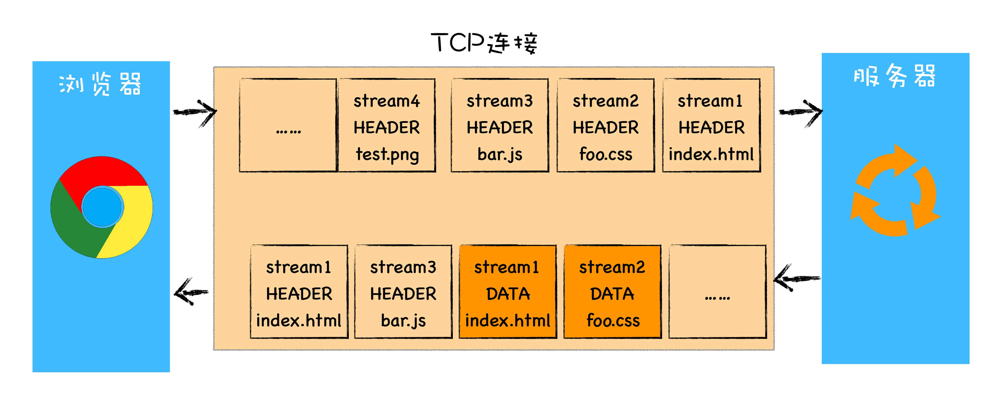
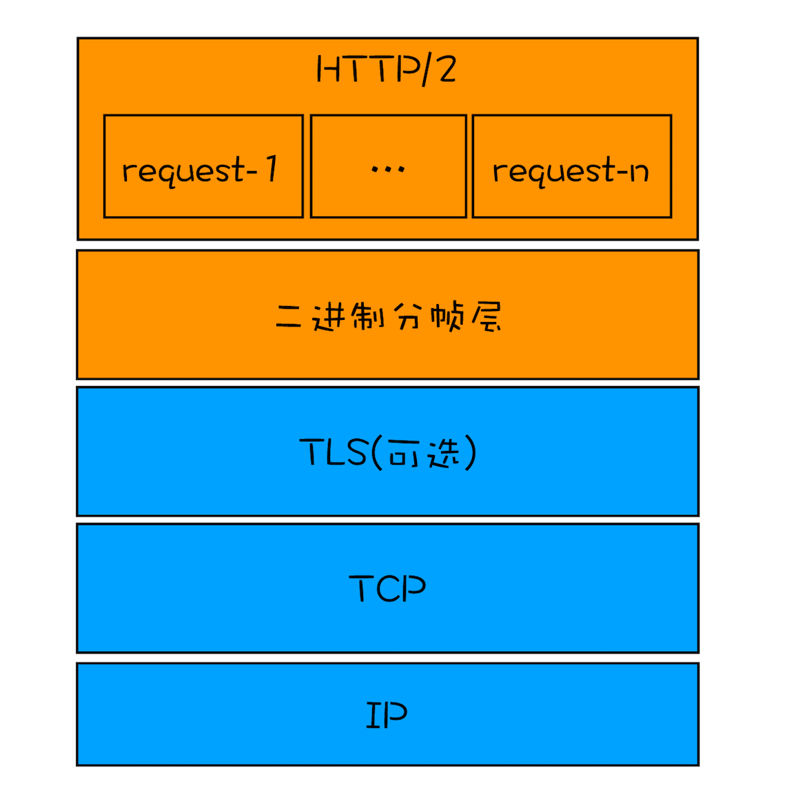
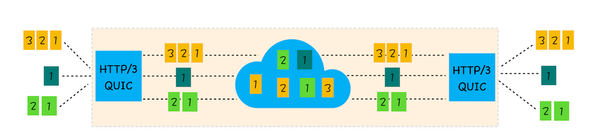

# HTTP 的进化史

## HTTP/0.9

### 诞生背景

- HTTP/0.9 是于 1991 年提出的，主要用于学术交流，需求很简单——用来在网络之间传递 HTML 超文本的内容，所以被称为超文本传输协议。
- 整体来看，它的实现也很简单，采用了基于请求响应的模式，从客户端发出请求，服务器返回数据

### HTTP/0.9 的实现特点

1. 第一个是只有一个请求行，并没有 HTTP 请求头和请求体，因为只需要一个请求行就可以完整表达客户端的需求了。
2. 第二个是服务器也没有返回头信息，这是因为服务器端并不需要告诉客户端太多信息，只需要返回数据就可以了。
3. 第三个是返回的文件内容是以 ASCII 字符流来传输的，因为都是 HTML 格式的文件，所以使用 ASCII 字节码来传输是最合适的

### HTTP/0.9 请求流程

## HTTP/1.0

### 诞生背景

- 万维网的高速发展带来了很多新的需求，浏览器中展示的不单是 HTML 文件了，还包括了 JavaScript、CSS、图片、音频、视频等不同类型的文件。
- 因此支持多种类型的文件下载是 HTTP/1.0 的一个核心诉求，而且文件格式不仅仅局限于 ASCII 编码，还有很多其他类型编码的文件。

### HTTP/1.0 的实现特点

1. `引入了请求头和响应`，来支持多种类型的文件；
   在发起请求时候会通过 HTTP 请求头告诉服务器它期待服务器返回什么类型的文件、采取什么形式的压缩、提供什么语言的文件以及文件的具体编码
2. `引入了状态码`通知浏览器，告诉服务器最终处理该请求的情况
3. `提供了 Cache 机制`来减轻服务器的压力
4. 新增`用户代理的字段`服给务器统计客户端的基础信息

### HTTP/1.0 的请求流程

## HTTP/1.1

### 诞生背景

- 每进行一次 HTTP 通信，都需要经历建立 `TCP 连接、传输 HTTP 数据和断开 TCP 连接三个阶段`，随着浏览器普及，单个页面中的图片文件越来越多这个相当于增加`大量无谓的开销`
- TCP 通道中的某个请求因为某些原因没有及时返回，那么就会阻塞后面的所有请求，这就是著名的`队头阻塞`的问题
- 在 HTTP/1.0 中，每个`域名绑定了一个唯一的 IP 地址`，因此一个服务器只能支持一个域名
- 在设计 HTTP/1.0 时，需要在`响应头中设置完整的数据大小`，如 Content-Length: 901，这样浏览器就可以根据设置的数据大小来接收数据。不过随着服务器端的技术发展，很多页面的内容都是动态生成的，因此在传输数据之前并不知道最终的数据大小，这就导致了浏览器不知道何时会接收完所有的文件数据

### HTTP/1.1 的实现特点

1. `增加了持久连接的方法`，它的特点是在一个 TCP 连接上可以传输多个 HTTP 请求，只要浏览器或者服务器没有明确断开连接，那么该 TCP 连接会一直保持
2. `HTTP 管线化`: 将多个 HTTP 请求整批提交给服务器的技术，虽然可以整批发送请求，不过服务器依然需要根据请求顺序来回复浏览器的请求
3. 请求头中`增加了 Host 字段`，用来表示当前的域名地址，这样服务器就可以根据不同的 Host 值做不同的处理
4. `引入 Chunk transfer 机制`来解决动态生成的内容，服务器会将数据分割成若干个任意大小的数据块，每个数据块发送时会附上上个数据块的长度，最后使用一个零长度的块作为发送数据完成的标志。这样就提供了对动态内容的支持
5. 客户端 Cookie、安全机制

## HTTP/2

### 诞生背景

- 解决 HTTP/1.1 的主要问题
- TCP 的慢启动

  > 一个 TCP 连接建立之后，就进入了发送数据状态，刚开始 TCP 协议会采用一个非常慢的速度去发送数据，然后慢慢加快发送数据的速度，直到发送数据的速度达到一个理想状态，这个过程称为慢启动

  > 慢启动会带来性能问题，是因为页面中常用的一些关键资源文件本来就不大，如 HTML 文件、CSS 文件和 JavaScript 文件，通常这些文件在 TCP 连接建立好之后就要发起请求的，但这个过程是慢启动，所以耗费的时间比正常的时间要多很多，这样就推迟了宝贵的首次渲染页面的时长了

- 同时开启了多条 TCP 连接，那么这些连接会竞争固定的带宽

  > 系统同时建立了多条 TCP 连接，当带宽充足时，每条连接发送或者接收速度会慢慢向上增加；而一旦带宽不足时，这些 TCP 连接又会减慢发送或者接收的速度；

  > 例如，一个网页有 200 个文件，通过 3 个不同的 CDN 提供服务，那么加载该页面可能需要建立 18 个 TCP 连接来并行下载资源。在实际下载过程中，如果带宽不足以支持所有连接的全速传输，各个 TCP 连接必须降低接收数据的速度以适应总带宽限制

  > 因为有的 TCP 连接下载的是一些关键资源，如 CSS 文件、JavaScript 文件等，而有的 TCP 连接下载的是图片、视频等普通的资源文件，但是多条 TCP 连接之间又不能协商让哪些关键资源优先下载，这样就有可能影响那些关键资源的下载速度了

- HTTP/1.1 队头阻塞的问题

### HTTP/2 的实现特点

1. HTTP/2 的解决方案可以总结为：一个域名只使用一个 TCP 长连接和消除队头阻塞问题

   > 整个页面资源的下载过程只需要一次慢启动，同时也避免了多个 TCP 连接竞争带宽所带来的问题

   > 实现资源的并行请求，也就是任何时候都可以将请求发送给服务器，而并不需要等待其他请求的完成，然后服务器也可以随时返回处理好的请求资源给浏览器

2. HTTP/2 其他特性
   - 可以设置请求的优先级
   - 服务器推送
   - 头部压缩

### HTTP/2 的请求流程

- 该图就是 HTTP/2 最核心、最重要且最具颠覆性的多路复用机制
- HTTP/2 使用了多路复用技术，可以将请求分成一帧一帧的数据去传输，
- 这样带来了一个额外的好处，就是当收到一个优先级高的请求时，
- 比如接收到 JavaScript 或者 CSS 关键资源的请求，
- 服务器可以暂停之前的请求来优先处理关键资源的请求

### 多路复用的实现

1. 首先，浏览器准备好请求数据，包括了请求行、请求头等信息，如果是 POST 方法，那么还要有请求体。
2. 这些数据经过二进制分帧层处理之后，会被转换为一个个带有请求 ID 编号的帧，通过协议栈将这些帧发送给服务器。
3. 服务器接收到所有帧之后，会将所有相同 ID 的帧合并为一条完整的请求信息。
4. 然后服务器处理该条请求，并将处理的响应行、响应头和响应体分别发送至二进制分帧层。
5. 同样，二进制分帧层会将这些响应数据转换为一个个带有请求 ID 编号的帧，经过协议栈发送给浏览器。
6. 浏览器接收到响应帧之后，会根据 ID 编号将帧的数据提交给对应的请求

## HTTP/3

### 诞生背景

- `TCP 的队头阻塞`:虽然 HTTP/2 解决了应用层面的队头阻塞问题，不过和 HTTP/1.1 一样，HTTP/2 依然是基于 TCP 协议的，而 TCP 最初就是为了单连接而设计的;

  > HTTP/2 中，多个请求是跑在一个 TCP 管道中的，如果其中任意一路数据流中出现了丢包的情况，那么就会阻塞该 TCP 连接中的所有请求

- `TCP 建立连接的延时`: TCP 的握手过程影响传输效率

  > 在建立 TCP 连接的时候，需要和服务器进行三次握手来确认连接成功，也就是说需要在消耗完 1.5 个 RTT 之后才能进行数据传输

  > 进行 TLS 连接，TLS 有两个版本——TLS1.2 和 TLS1.3，每个版本建立连接所花的时间不同，大致是需要 1 ～ 2 个 RTT

- `TCP 协议僵化`: TCP 协议都是通过操作系统内核来实现的，应用程序只能使用不能修改。通常操作系统的更新都滞后于软件的更新，因此要想自由地更新内核中的 TCP 协议也是非常困难的

### HTTP/3 的实现特点

- HTTP/3 选择了一个折衷的方法——UDP 协议，基于 UDP 实现了类似于 TCP 的多路数据流、传输可靠性等功能，我们把这套功能称为 QUIC 协议
  

- `实现了类似 TCP 的流量控制`、传输可靠性的功能。虽然 UDP 不提供可靠性的传输，但 QUIC 在 UDP 的基础之上增加了一层来保证数据可靠性传输。它提供了数据包重传、拥塞控制以及其他一些 TCP 中存在的特性。
- `集成了 TLS 加密功能`。目前 QUIC 使用的是 TLS1.3，相较于早期版本 TLS1.3 有更多的优点，其中最重要的一点是减少了握手所花费的 RTT 个数。
- `实现了 HTTP/2 中的多路复用功能`。和 TCP 不同，QUIC 实现了在同一物理连接上可以有多个独立的逻辑数据流（如下图）。实现了数据流的单独传输，就解决了 TCP 中队头阻塞的问题。

### QUIC 协议的多路复用

- QUIC 是基于 UDP 的，所以 QUIC 可以实现使用 0-RTT 或者 1-RTT 来建立连接，这意味着 QUIC 可以用最快的速度来发送和接收数据，这样可以大大提升首次打开页面的速度

## 参考文献

- https://time.geekbang.org/column/article/147501
