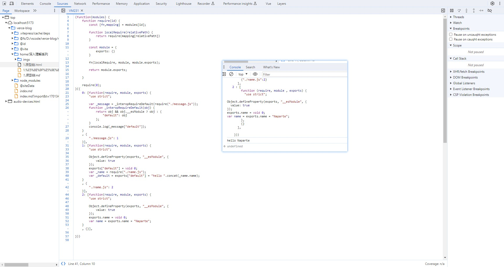

# Build your own bundler

## 1. 收集依赖

- 收集依赖; 通过 ast 语法的 import 节点收集

```javascript
const fs = require("fs");
const path = require("path");
const babylon = require("babylon");
const traverse = require("@babel/traverse").default;
const babel = require("@babel/core");

function createAsset(filename) {
  const content = fs.readFileSync(filename, "utf-8");

  const ast = babylon.parse(content, {
    sourceType: "module",
  });

  const dependencies = [];

  traverse(ast, {
    ImportDeclaration: ({ node }) => {
      dependencies.push(node.source.value);
    },
  });

  const id = ID++;
  const { code } = babel.transformFromAst(ast, null, {
    presets: ["@babel/preset-env"],
  });

  return {
    id,
    filename,
    dependencies,
    code,
  };
}
```

## 2. 生成依赖图

- 生成依赖图；遍历所有的依赖递归收集依赖，形成依赖图；

```javascript
function createGraph(entry) {
  const mainAsset = createAsset(entry);

  const queue = [mainAsset];

  for (const asset of queue) {
    const dirname = path.dirname(asset.filename);

    asset.mapping = {};

    asset.dependencies.forEach((relativePath) => {
      const absolutePath = path.join(dirname, relativePath);
      const child = createAsset(absolutePath);

      asset.mapping[relativePath] = child.id;

      queue.push(child);
    });
  }

  console.log("---依赖图---", queue);
  return queue;
}
```

## 3. 构建组装代码

- 构建结果

```javascript
function bundle(graph) {
  let modules = "";

  graph.forEach((mod) => {
    modules += ` ${mod.id} : [
        function (require, module , exports) {
          ${mod.code}
        },
        ${JSON.stringify(mod.mapping)}
      ],
  `;
  });

  console.log("--module--", modules);

  const result = `

    (function(modules){
      function require(id) {
        const [fn, mapping] = modules[id];

        function localRequire(relativePath) {
            return require(mapping[relativePath])
        }

        const module = { exports: {} }

        fn(localRequire, module, module.exports);

        return module.exports;

      }

      require(0);
    }({
    ${modules}
    }))

`;

  console.log("--构建结果--", result);

  return result;
}
```



## 参考视频

<video width="800" height="400" controls>
  <source src="https://upos-sz-mirrorali.bilivideo.com/upgcxcode/93/89/447178993/447178993-1-208.mp4?e=ig8euxZM2rNcNbRVhwdVhwdlhWdVhwdVhoNvNC8BqJIzNbfq9rVEuxTEnE8L5F6VnEsSTx0vkX8fqJeYTj_lta53NCM=&uipk=5&nbs=1&deadline=1701411944&gen=playurlv2&os=alibv&oi=2032205461&trid=c8f3638234494c608e2398b79a383d72T&mid=298741099&platform=html5&upsig=53bc69277bbc0dc17905d7f1b2b07614&uparams=e,uipk,nbs,deadline,gen,os,oi,trid,mid,platform&bvc=vod&nettype=0&bw=61654&orderid=0,1&buvid=&build=0&mobi_app=&f=T_0_0&logo=80000000" type="video/mp4" />
</video>

## 完整代码参考

- [demo 地址 https://github.com/Naparte/my-bundler](https://github.com/Naparte/my-bundler)

```javascript
const fs = require("fs");
const path = require("path");
const babylon = require("babylon");
const traverse = require("@babel/traverse").default;
const babel = require("@babel/core");

let ID = 0;

// 收集依赖; 通过ast语法的import节点收集
function createAsset(filename) {
  const content = fs.readFileSync(filename, "utf-8");

  const ast = babylon.parse(content, {
    sourceType: "module",
  });

  const dependencies = [];

  traverse(ast, {
    ImportDeclaration: ({ node }) => {
      dependencies.push(node.source.value);
    },
  });

  const id = ID++;
  const { code } = babel.transformFromAst(ast, null, {
    presets: ["@babel/preset-env"],
  });

  return {
    id,
    filename,
    dependencies,
    code,
  };
}

// 生成依赖图；遍历所有的依赖递归收集依赖，形成依赖图；
function createGraph(entry) {
  const mainAsset = createAsset(entry);

  const queue = [mainAsset];

  for (const asset of queue) {
    const dirname = path.dirname(asset.filename);

    asset.mapping = {};

    asset.dependencies.forEach((relativePath) => {
      const absolutePath = path.join(dirname, relativePath);
      const child = createAsset(absolutePath);

      asset.mapping[relativePath] = child.id;

      queue.push(child);
    });
  }

  console.log("---依赖图---", queue);
  return queue;
}

// 构建结果
function bundle(graph) {
  let modules = "";

  graph.forEach((mod) => {
    modules += ` ${mod.id} : [
        function (require, module , exports) {
          ${mod.code}
        },
        ${JSON.stringify(mod.mapping)}
      ],
  `;
  });

  console.log("--module--", modules);

  const result = `

    (function(modules){
      function require(id) {
        const [fn, mapping] = modules[id];

        function localRequire(relativePath) {
            return require(mapping[relativePath])
        }

        const module = { exports: {} }

        fn(localRequire, module, module.exports);

        return module.exports;

      }

      require(0);
    }({
    ${modules}
    }))

`;

  console.log("--构建结果--", result);

  return result;
}

const graph = createGraph("./example/entry.js");

const result = bundle(graph);
```
