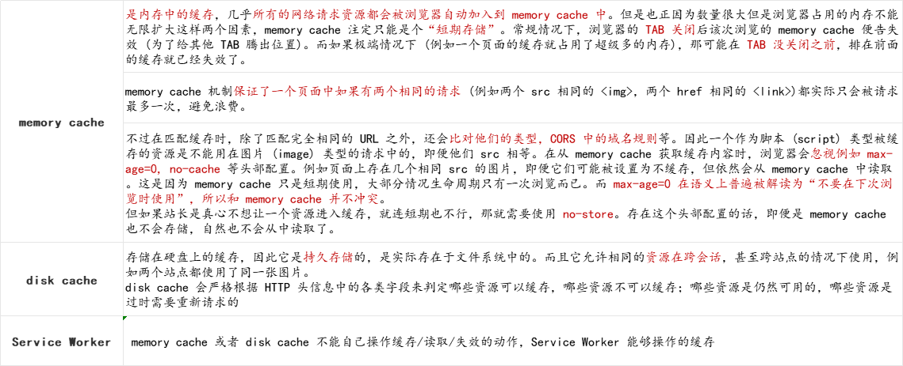
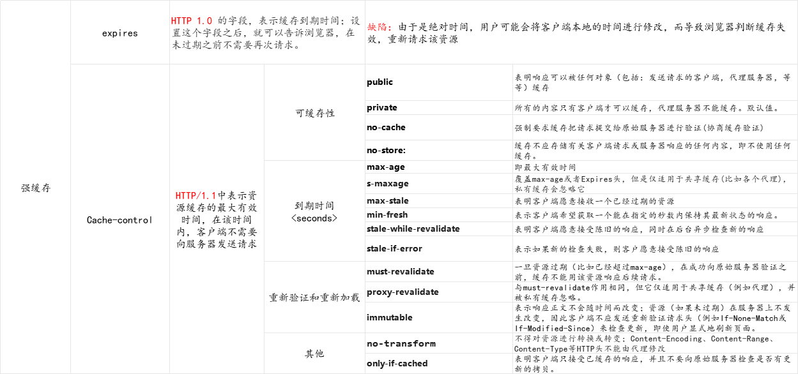
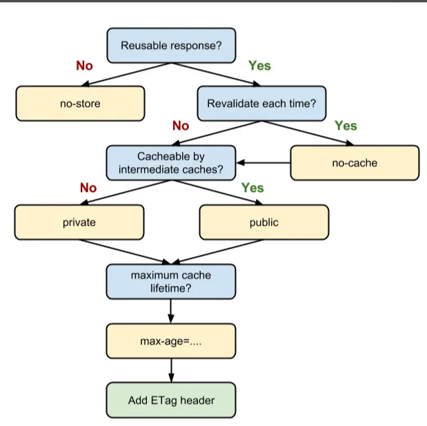

# 浏览器缓存

## 缓存解决了什么问题？

- Chrome 官方给出的解释
  > 通过网络获取内容既速度缓慢又开销巨大。较大的响应需要在客户端与服务器之间进行多次往返通信，这会延迟浏览器获得和处理内容的时间，还会增加访问者的流量费用。因此，缓存并重复利用之前获取的资源的能力成为性能优化的一个关键方面。

## 缓存位置分类

### memory cache

- 是内存中的缓存，几乎所有的网络请求资源都会被浏览器自动加入到 memory cache 中。但是也正因为数量很大但是浏览器占用的内存不能无限扩大这样两个因素，memory cache 注定只能是个“短期存储”。常规情况下，浏览器的 TAB 关闭后该次浏览的 memory cache 便告失效 (为了给其他 TAB 腾出位置)。而如果极端情况下 (例如一个页面的缓存就占用了超级多的内存)，那可能在 TAB 没关闭之前，排在前面的缓存就已经失效了。

- memory cache 机制保证了一个页面中如果有两个相同的请求 (例如两个 src 相同的 ，两个 href 相同的 <link>)都实际只会被请求最多一次，避免浪费。

- 不过在匹配缓存时，除了匹配完全相同的 URL 之外，还会比对他们的类型，CORS 中的域名规则等。因此一个作为脚本 (script) 类型被缓存的资源是不能用在图片 (image) 类型的请求中的，即便他们 src 相等。在从 memory cache 获取缓存内容时，浏览器会忽视例如 max-age=0, no-cache 等头部配置。例如页面上存在几个相同 src 的图片，即便它们可能被设置为不缓存，但依然会从 memory cache 中读取。这是因为 memory cache 只是短期使用，大部分情况生命周期只有一次浏览而已。而 max-age=0 在语义上普遍被解读为“不要在下次浏览时使用”，所以和 memory cache 并不冲突。但如果站长是真心不想让一个资源进入缓存，就连短期也不行，那就需要使用 no-store。存在这个头部配置的话，即便是 memory cache 也不会存储，自然也不会从中读取了。

### disk cache

- 存储在硬盘上的缓存，因此它是持久存储的，是实际存在于文件系统中的。而且它允许相同的资源在跨会话，甚至跨站点的情况下使用，例如两个站点都使用了同一张图片。
  disk cache 会严格根据 HTTP 头信息中的各类字段来判定哪些资源可以缓存，哪些资源不可以缓存；哪些资源是仍然可用的，哪些资源是过时需要重新请求的

### Service Worker

- memory cache 或者 disk cache 不能自己操作缓存/读取/失效的动作，Service Worker 能够操作的缓存

## 失效策略分类

### 强缓存

- expires

  > HTTP 1.0 的字段，表示缓存到期时间；设置这个字段之后，就可以告诉浏览器，在未过期之前不需要再次请求
  >   缺陷：由于是绝对时间，用户可能会将客户端本地的时间进行修改，而导致浏览器判断缓存失效，重新请求该资源

- Cache-control

  > HTTP/1.1 中表示资源缓存的最大有效时间，在该时间内，客户端不需要向服务器发送请求

- 可缓存性

  - `public` 表明响应可以被任何对象（包括：发送请求的客户端，代理服务器，等等）缓存
  - `private` 所有的内容只有客户端才可以缓存，代理服务器不能缓存。默认值。
  - `no-cache` 强制要求缓存把请求提交给原始服务器进行验证(协商缓存验证)
  - `no-store` 缓存不应存储有关客户端请求或服务器响应的任何内容，即不使用任何缓存。

- 到期时间

  - `max-age` 即最大有效时间
  - `s-maxage` 覆盖 max-age 或者 Expires 头，但是仅适用于共享缓存(比如各个代理)，私有缓存会忽略它
  - `max-stale` 表明客户端愿意接收一个已经过期的资源
  - `min-fres`h 表示客户端希望获取一个能在指定的秒数内保持其最新状态的响应。
  - `stale-while-revalidate` 表明客户端愿意接受陈旧的响应，同时在后台异步检查新的响应
  - `stale-if-error` 表示如果新的检查失败，则客户愿意接受陈旧的响应

- 重新验证和重新加载

  - `must-revalidate` 一旦资源过期（比如已经超过 max-age），在成功向原始服务器验证之前，缓存不能用该资源响应后续请求。
  - `proxy-revalidat`e 与 must-revalidate 作用相同，但它仅适用于共享缓存（例如代理），并被私有缓存忽略。
  - `immutable` 表示响应正文不会随时间而改变；资源（如果未过期）在服务器上不发生改变，因此客户端不应发送重新验证请求头（例如 If-None-Match 或 If-Modified-Since）来检查更新，即使用户显式地刷新页面。

- 其他
  - `no-transform` 不得对资源进行转换或转变；Content-Encoding、Content-Range、Content-Type 等 HTTP 头不能由代理修改
  - `only-if-cached` 表明客户端只接受已缓存的响应，并且不要向原始服务器检查是否有更新的拷贝。

### 协商缓存

- Last-Modified & If-Modified-Since

  > 服务器通过  Last-Modified  字段告知客户端，下一次请求相同资源时时，浏览器从自己的缓存中找出“不确定是否过期的”缓存。因此在请求头中将上次的 Last-Modified 的值写入到请求头的 If-Modified-Since 字段

  > 缺陷：
  >   1、如果资源更新的速度是秒以下单位，那么该缓存是不能被使用的，因为它的时间单位最低是秒。
  >   2、如果文件是通过服务器动态生成的，那么该方法的更新时间永远是生成的时间，尽管文件可能没有变化，所以起不到缓存的作用。

- Etag & If-None-Match
  > Etag 是由服务器为每个资源生成的唯一的标识字符串，这个标识字符串是基于文件内容编码的，只要文件内容不同，它们对应的 Etag 就是不同的，反之亦然。Etag 的生成过程需要服务器额外付出开销，会影响服务端的性能，这是它的弊端；Etag 的优先级高于 Last-Modified

## SAQ

- max-age=0 和 no-cache 等价吗？
  > 从规范的字面意思来说，max-age 到期是 应该(SHOULD) 重新验证，而 no-cache 是 必须(MUST) 重新验证。但实际情况以浏览器实现为准，大部分情况他们俩的行为还是一致的。

## HTTP 缓存决策指南

## 参考文献

- https://juejin.cn/post/6844903747357769742#heading-6
- https://juejin.cn/book/6844733750048210957/section/6844733750106931214
