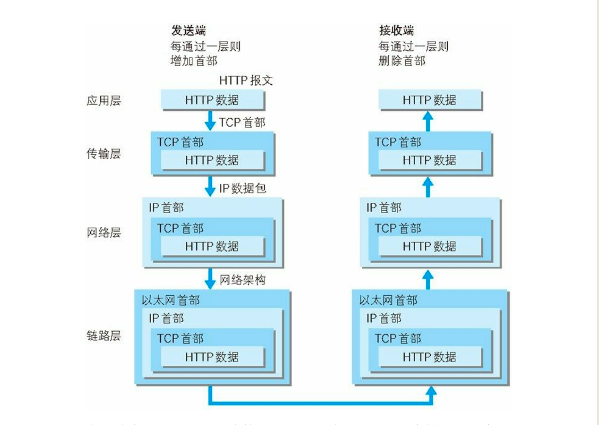

# 图解 http

## 了解 Web 及网络基础

### HTTP 的诞生

- 1989 年 3 月，互联网还只属于少数人。在这一互联网的黎明期，HTTP 诞生了。
- CERN（欧洲核子研究组织）的蒂姆 • 伯纳斯 - 李（Tim BernersLee）博士提出了一种能让远隔两地的研究者们共享知识的设想。
- 最初设想的基本理念是：借助多文档之间相互关联形成的超文本（HyperText），连成可相互参阅的 WWW（World Wide Web，万维网）。
- 现在已 ᨀ 出了 3 项 WWW 构建技术，分别是：
  - 把 SGML（Standard Generalized Markup Language，标准通用标记语言）作为页面的文本标记语言的 HTML（HyperText Markup Language，超文本标记语言）；
  - 作为文档传递协议的 HTTP ；
  - 指定文档所在地址的 URL（Uniform Resource Locator，统一资源定位符）。
- WWW 这一名称，是 Web 浏览器当年用来浏览超文本的客户端应用程序时的名称。现在则用来表示这一系列的集合，也可简称为 Web

### TCP/IP

- 通常使用的网络（包括互联网）是在 TCP/IP 协议族的基础上运作
  的。而 HTTP 属于它内部的一个子集
- TCP/IP 是互联网相关的各类协议族的总称

#### `TCP/IP 的分层管理`

- 应用层
  - 应用层决定了向用户提供应用服务时通信的活动。TCP/IP 协议族内预存了各类通用的应用服务。比如，FTP 、DNS、HTTP 。
- 传输层
  - 传输层对上层应用层，提供处于网络连接中的两台计算机之间的数据传输。在传输层有两个性质不同的协议：TCP 和 UDP。
- 网络层（又名网络互连层）
  - 网络层用来处理在网络上流动的数据包。数据包是网络传输的最小数据单位。该层规定了通过怎样的路径（所谓的传输路线）到达对方计算机，并把数据包传送给对方。与对方计算机之间通过多台计算机或网络设备进行传输时，网络层所起的作用就是在众多的选项内选择一条传输路线。
- 链路层（又名数据链路层，网络接口层）
  - 用来处理连接网络的硬件部分。包括控制操作系统、硬件的设备驱动、NIC（Network Interface Card，网络适配器，即网卡），及光纤等物理可见部分（。硬件上的范畴均在链路层的作用范围之内

## 简单的 HTTP 协议

- HTTP 协议和 TCP/IP 协议族内的其他众多的协议相同，用于客户端和
  服务器之间的通信。
- 请求访问文本或图像等资源的一端称为客户端，而提供资源响应的一
  端称为服务器端
- `HTTP 是不保存状态的协议`，为了实现期望的保持状态功能，于
  是引入了 Cookie 技术

### HTTP 方法

| 方法    | 说明                                       | 支持的 HTTP 协议版本   |
| ------- | ------------------------------------------ | ---------------------- |
| GET     | 获取资源                                   | 1.0、1.1               |
| POST    | 传输实体主体（例如表单数据）               | 1.0、1.1               |
| PUT     | 传输文件或更新资源                         | 1.0、1.1               |
| HEAD    | 获得报文首部信息，但不返回实体内容         | 1.0、1.1               |
| DELETE  | 删除指定的资源                             | 1.0、1.1               |
| OPTIONS | 查询服务器支持哪些 HTTP 方法               | 1.1                    |
| TRACE   | 回显服务器收到的请求，用于测试和诊断       | 1.1                    |
| CONNECT | 要求在服务器与代理之间建立隧道，常用于 SSL | 1.1                    |
| LINK    | 建立当前文档和另一个文档之间的关系链接     | 1.0 （实际中并不常用） |
| UNLINK  | 断开两个通过 LINK 方法建立的关系           | 1.0 （实际中并不常用） |

## HTTP 状态码

| 类别                                 | 原因短语                                   |
| ------------------------------------ | ------------------------------------------ |
| 1XX Informational（信息性状态码）    | 接收到请求，服务器正在处理中               |
| 2XX Success（成功状态码）            | 请求已成功接收并处理完成                   |
| 3XX Redirection（重定向状态码）      | 需要客户端进行额外操作（如跳转）以完成请求 |
| 4XX Client Error（客户端错误状态码） | 由于客户端原因导致服务器无法满足请求       |
| 5XX Server Error（服务器错误状态码） | 服务器在处理请求过程中遇到错误             |

### 　状态吗详解

| 类别                      | 原因短语                                                                                                               |
| ------------------------- | ---------------------------------------------------------------------------------------------------------------------- |
| 200 OK                    | 表示从客户端发来的请求在服务器端被正常处理了                                                                           |
| 204 No Content            | 代表服务器接收的请求已成功处理，但在返回的响应报文中不含实体的主体部分                                                 |
| 206 Partial Content       | 表示客户端进行了范围请求，而服务器成功执行了这部分的 GET 请求。响应报文中包含由 Content-Range 指定范围的实体内容       |
| 301 Moved Permanently     | 永久性重定向。表示请求的资源已被分配了新的 URI，以后应使用资源现在所指的 URI                                           |
| 302 Found                 | 临时性重定向。表示请求的资源已被分配了新的 URI，希望用户（本次）能使用新的 URI 访问                                    |
| 303 See Other             | 由于请求对应的资源存在着另一个 URI，应使用 GET 方法定向获取请求的资源                                                  |
| 304 Not Modified          | 表示客户端发送附带条件的请求时，服务器端允许请求访问资源，但未满足条件的情况。304 状态码返回时不包含任何响应的主体部分 |
| 307 Temporary Redirect    | 临时重定向。与 302 Found 有着相同的含义                                                                                |
| 400 Bad Request           | 表示请求报文中存在语法错误                                                                                             |
| 401 Unauthorized          | 表示发送的请求需要有通过 HTTP 认证（BASIC 认证、DIGEST 认证）的认证信息                                                |
| 403 Forbidden             | 表明对请求资源的访问被服务器拒绝了                                                                                     |
| 404 Not Found             | 表明服务器上无法找到请求的资源                                                                                         |
| 500 Internal Server Error | 表明服务器端在执行请求时发生了错误。也有可能是 Web 应用存在的 bug 或某些临时的故障                                     |
| 503 Service Unavailable   | 表明服务器暂时处于超负载或正在进行停机维护，现在无法处理请求                                                           |

## 在 HTTP 出现之前的协议

| 协议名称                              | 描述                                                                                                       |
| ------------------------------------- | ---------------------------------------------------------------------------------------------------------- |
| FTP (File Transfer Protocol)          | 传输文件时使用的协议，历史悠久，可追溯至 1973 年前后，尽管在 1995 年被 HTTP 的流量超越，至今仍广泛沿用。   |
| NNTP (Network News Transfer Protocol) | 用于 NetNews 电子会议室中消息传递的协议，于 1986 年前后出现，随着 Web 信息交换成为主流，该协议已较少使用。 |
| Archie                                | 搜索匿名 FTP 公开文件信息的协议，约在 1990 年前后出现，目前不常使用。                                      |
| WAIS (Wide Area Information Servers)  | 通过关键词检索多个数据库的协议，诞生于 1991 年前后，现已被 HTTP 协议替代，不再常见。                       |
| Gopher                                | 查找互联网连接计算机内信息的协议，同样在 1991 年前后出现，由于被 HTTP 协议取代，现今已较少使用。           |

## HTTP 首部

### 通用首部字段

| 首部字段名        | 说明                       |
| ----------------- | -------------------------- |
| Cache-Control     | 控制缓存的行为             |
| Connection        | 逐跳首部、连接的管理       |
| Date              | 创建报文的日期时间         |
| Pragma            | 报文指令                   |
| Trailer           | 报文末端的首部一览         |
| Transfer-Encoding | 指定报文主体的传输编码方式 |
| Upgrade           | 升级为其他协议             |
| Via               | 代理服务器的相关信息       |
| Warning           | 错误通知                   |

### 请求首部字段

| 首部字段名          | 说明                                            |
| ------------------- | ----------------------------------------------- |
| Accept              | 用户代理可处理的媒体类型                        |
| Accept-Charset      | 优先的字符集                                    |
| Accept-Encoding     | 优先的内容编码                                  |
| Accept-Language     | 优先的语言（自然语言）                          |
| Authorization       | Web 认证信息                                    |
| Expect              | 期待服务器的特定行为                            |
| From                | 用户的电子邮箱地址                              |
| Host                | 请求资源所在服务器                              |
| If-Match            | 比较实体标记（ETag）                            |
| If-Modified-Since   | 比较资源的更新时间                              |
| If-None-Match       | 比较实体标记（与 If-Match 相反）                |
| If-Range            | 资源未更新时发送实体 Byte 的范围请求            |
| If-Unmodified-Since | 比较资源的更新时间（与 If-Modified-Since 相反） |
| Max-Forwards        | 最大传输逐跳数                                  |
| Proxy-Authorization | 代理服务器要求客户端的认证信息                  |
| Range               | 实体的字节范围请求                              |
| Referer             | 对请求中 URI 的原始获取方                       |
| TE                  | 传输编码的优先级                                |
| User-Agent          | HTTP 客户端程序的信息                           |

### 响应首部字段

| 首部字段名         | 说明                         |
| ------------------ | ---------------------------- |
| Accept-Ranges      | 是否接受字节范围请求         |
| Age                | 推算资源创建经过时间         |
| ETag               | 资源的匹配信息               |
| Location           | 令客户端重定向至指定 URI     |
| Proxy-Authenticate | 代理服务器对客户端的认证信息 |
| Retry-After        | 对再次发起请求的时机要求     |
| Server             | HTTP 服务器的安装信息        |
| Vary               | 代理服务器缓存的管理信息     |
| WWW-Authenticate   | 服务器对客户端的认证信息     |

### 实体首部字段

| 首部字段名       | 说明                                   |
| ---------------- | -------------------------------------- |
| Allow            | 资源可支持的 HTTP 方法                 |
| Content-Encoding | 实体主体适用的编码方式（如 gzip）      |
| Content-Language | 实体主体的自然语言                     |
| Content-Length   | 实体主体的大小（单位：字节）           |
| Content-Location | 替代对应资源的 URI                     |
| Content-MD5      | 实体主体的报文摘要，用于校验传输完整性 |
| Content-Range    | 实体主体的位置范围，用于字节范围请求   |
| Content-Type     | 实体主体的媒体类型及字符集             |
| Expires          | 实体主体过期的日期时间，决定缓存有效期 |
| Last-Modified    | 资源的最后修改日期时间，用于缓存验证   |

### Cookie 服务的首部字段

| 首部字段名 | 说明                             | 首部类型     |
| ---------- | -------------------------------- | ------------ |
| Set-Cookie | 开始状态管理所使用的 Cookie 信息 | 响应首部字段 |
| Cookie     | 服务器接收到的 Cookie 信息       | 请求首部字段 |

#### Set-Cookie 属性

| 属性         | 说明                                                                                                      |
| ------------ | --------------------------------------------------------------------------------------------------------- |
| NAME=VALUE   | 必需项，赋予 Cookie 的名称及其对应的值                                                                    |
| expires=DATE | 指定 Cookie 的有效期，若不明确指定，则默认为浏览器关闭前为止                                              |
| path=PATH    | 设置服务器上文件目录作为 Cookie 的适用对象，若不指定则默认为创建 Cookie 的文档所在的文件目录              |
| domain=域名  | 指定 Cookie 适用的域名，若不指定则默认为创建 Cookie 的服务器域名                                          |
| Secure       | 标识符，仅在 HTTPS 安全通信时该 Cookie 才会被发送到服务器                                                 |
| HttpOnly     | 标识符，限制 Cookie 不能通过 JavaScript 脚本访问，有助于防止跨站脚本攻击（XSS）对 Cookie 信息的窃取和篡改 |

### 其他首部字段

| 首部字段名       | 说明                                                                | 可选值与含义                                                 |
| ---------------- | ------------------------------------------------------------------- | ------------------------------------------------------------ |
| X-Frame-Options  | 控制网站内容在其他 Web 网站的 Frame 标签内的显示问题，防止点击劫持  | DENY：拒绝 SAMEORIGIN：仅同源域名下的页面匹配时许可       |
| X-XSS-Protection | 针对跨站脚本攻击（XSS）的一种对策，控制浏览器 XSS 防护机制开关      | 0：将 XSS 过滤设置成无效状态 1：将 XSS 过滤设置成有效状态 |
| DNT              | Do Not Track 的简称，表示用户是否同意被精准广告追踪                 | 0：同意被追踪 1：拒绝被追踪                               |
| P3P              | 让 Web 网站上的个人隐私信息以程序可理解的形式呈现，旨在保护用户隐私 | -                                                            |

## 确保 Web 安全的 HTTPS

- HTTP+ 加密 + 认证 + 完整性保护 = HTTPS

## 确认访问用户身份的认证

- BASIC 认证（基本认证）
- DIGEST 认证（摘要认证）
- SSL 客户端认证
- FormBase 认证（基于表单认证）

## 基于 HTTP 的功能追加协议

### SPDY （消除 HTTP 瓶颈）

- `HTTP 标准就会成为瓶颈`

  1. 一条连接上只可发送一个请求。
  2. 请求只能从客户端开始。客户端不可以接收除响应以外的指
     令。
  3. 请求/响应首部未经压缩就发送。首部信息越多延迟越大。
  4. 发送冗长的首部。每次互相发送相同的首部造成的浪费较
     多

- SPDY 的设计与功能

  - SPDY 没有完全改写 HTTP 协议，而是在 TCP/IP 的应用层与运输层之间通过新加会话层的形式运作。同时，考虑到安全性问题，SPDY 规定通信中使用 SSL。
  - SPDY 以会话层的形式加入，控制对数据的流动，但还是采用 HTTP 建立通信连接。因此，可照常使用 HTTP 的 GET 和 POST 等方 法、Cookie 以及 HTTP 报文等。

- 使用 SPDY 后，HTTP 协议额外获得以下功能。

  1. `多路复用流`
     通过单一的 TCP 连接，可以无限制处理多个 HTTP 请求。所有请求
     的处理都在一条 TCP 连接上完成，因此 TCP 的处理效率得到提高。
  2. `赋予请求优先级`
     SPDY 不仅可以无限制地并发处理请求，还可以给请求逐个分配优先
     级顺序。这样主要是为了在发送多个请求时，解决因带宽低而导致响应变慢的问题
  3. ` 压缩 HTTP 首部`
     压缩 HTTP 请求和响应的首部。
  4. `推送功能`
     支持服务器主动向客户端推送数据的功能。
  5. `服务器提示功能`
     服务器可以主动提 示客户端请求所需的资源。

### WebSocket

### HTTP/2.0

### Web 服务器管理文件的 WebDAV

## Web 的攻击技术

- 对 Web 应用的攻击模式有两种

  1. 主动攻击：主动攻击（active attack）是指攻击者通过直接访问 Web 应用，把攻击代码传入的攻击模式
  2. 被动攻击：是指利用圈套策略执行攻击代码的攻击模式。在被动攻击过程中，攻击者不直接对目标 Web 应用访问发起攻击

| 安全漏洞类别       | 具体安全漏洞                                                                                                                        |
| ------------------ | ----------------------------------------------------------------------------------------------------------------------------------- |
| 输出值转义漏洞     | 跨站脚本攻击（XSS） SQL 注入攻击 OS 命令注入攻击 HTTP 首部注入攻击 邮件首部注入攻击 目录遍历攻击 远程文件包含漏洞 |
| 设置或设计上的漏洞 | 强制浏览 不正确的错误消息处理 开放重定向                                                                                      |
| 会话管理漏洞       | 会话劫持 会话固定攻击 跨站点请求伪造（CSRF）                                                                                  |
| 其他安全漏洞       | 密码破解 点击劫持 拒绝服务攻击（DoS） 后门程序                                                                             |

## 书本

[图解 Http.pdf](./files/图解Http.pdf)
