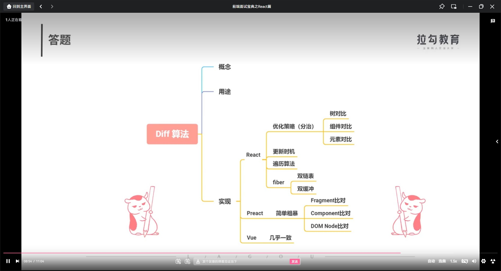

# 虚拟 DOM

## 虚拟 DOM 的工作原理是什么？

- 讲概念：通过 JS 对象模拟 DOM 节点，
- 说用途：在 FaceBook 初期考虑提高代码抽象能力，避免人为的操作 dom，降低代码风险的因素所以引入了虚拟 DOM
- 理思路：通过工具转换成，需要的 DOM 树
- 列优缺点：
- 核心问题：

## 虚拟 DOM 初衷

- FaceBook 创建 XHP 项目，

1. 简化前端开发：为了后端赋能，让后端开发人员能够快速交付页面
2. 避免跨站点的脚本攻击：

总结：通过虚拟 DOM 规避风险

## 虚拟 DOM 关键函数

- diff 函数： 计算状态变更前后的虚拟 DOM 树的差异
- render 函数：渲染整个虚拟 DOM 树或者处理差异点

## 虚拟 DOM 优劣势

- 优势：

  1. 大量的直接操作 DOM 容易引起网络性能下降。虚拟 Dom 可以降低 DOM 的操作范围和频次，提升页面性能
  2. 跨平台的成本更低

- 劣势：
  1.  内存占用较高
  2.  无法做到极致优化

## Diff 算法

- 讲概念：
- 说用途：
- 理思路：
- 列优缺点：
- 核心问题：

## Diff 算法优化策略

1. 忽略节点的层级操作场景，提升比对效率
   - 需要进行树对比，即对树进行分层比较，两棵树只对同一层次节点进行比较，如果发现节点已不存在则该节点及其子节点会被完全删除，不会用于进一步比较，提升比较效率
2. 如果组件的 class 一致，则默认为相似的树结构，否则默认为不同的树结构
   - 如果组件是同一类型则进行树比对，如果不是则直接放入补丁中
3. 同一层级子节点，可以通过标记 Key 的方式进行列表对比

