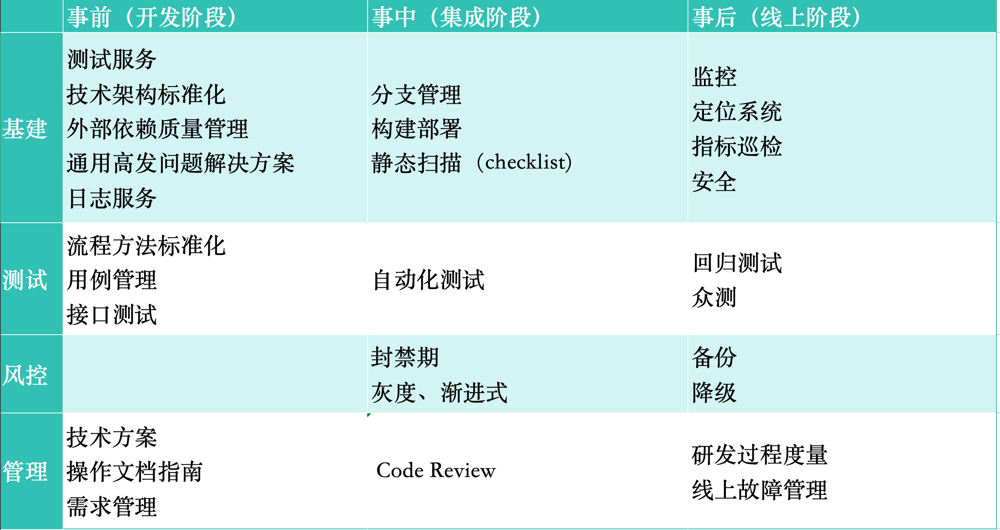

# 前端质量保障

## 基本原则

- `三层四面`

## 开发阶段

1. 测试服务

   - 测试作为质量保障的基础手段，其效率和准确性在很大程度上依赖于完善的测试环境、强大的测试工具以及高效的测试服务。
   - **对于兼容性测试**: 先进的工具可实现一键模拟多台设备渲染页面，并通过截图比对自动生成报告，显著提高问题定位速度，如能自动标识出存在问题的机型，则极大地`简化了兼容性问题的发现过程`。
   - **自动化测试方面**: 便捷的脚本录制功能使得非程序员也能快速创建自动化测试用例，无需手动编写代码来驱动测试流程。这种特性如网易 Airtest 等工具所具备的，可以极大`提升回归测试的覆盖面和执行效率`，`减轻人工测试负担`，确保产品质量得到持续有效的验证。

2. 技术架构标准化

   - 技术架构标准化是基于最佳实践的原则，其核心目标在于提升开发效率和保障开发质量。关键机制：
   - **预防与消除潜在问题**：技术架构标准化通过对设计的硬性约束，能够有效防止或减少因人为错误导致的故障隐患，通过`预先设定的技术规范和框架约束`，使得开发者在遵循标准的过程中降低出错概率。
   - **复杂度控制**：面对需求不断增长和技术规模扩大带来的复杂度挑战，技术架构标准化通过`采用框架`、`组件化`以及 `MVVM` 等架构模式来分解和简化系统结构，从而有效地管理并降低实现层面的复杂度。
   - **团队协作优化**：通过`约束开发模式、统一团队开发风格`，技术架构标准化有助于保持代码的一致性和可维护性，避免个人风格差异造成的额外复杂度，促进团队成员之间的高效协同工作，进一步提升整体项目的质量和稳定性。

3. 外部依赖质量管理

   - 通用的依赖一般来说有：CDN、网络、容器、接口、基础框架/库、sdk（埋点、监控之类的）、打包工具等等。关键要形成两点判断：
   - `第一，依赖是否可靠`，比如出问题了能否找到维护方、核心的依赖如果崩溃有没有降级兜底方案等；
   - `第二，依赖是否彻底解耦`，比如某些配置不应该跨项目或者跨团队存在，否则一定会相互中伤
   - CDN：一个主要问题是节点故障
   - 网络：一个主要问题是劫持，资源被劫持后，响应没有带跨域 Access-Control-Allow-Origin: \*这个头，就会导致资源因跨域而被浏览器拒绝执行，页面就挂了
   - 容器：Webview 可能出现各种问题
   - 接口：接口异常监控，还需要考虑对接口的调用量进行监控
   - 基础框架/库：原则上需要锁定版本，不要完全指望开发者遵循 semver 版本语义，任何变动都可能产生故障。
   - sdk：引入的 sdk 也是可能出问题的。像监控类的 sdk 必须先加载，且必须是同步加载，可考虑内联，避免网络加载失败
   - 打包工具:检测 es6 代码，检测循环引用，检测重复包等

4. 日志

   - 需要记日志场景：统计某个指标、排查问题、监控异常
   - 需要记日志的地方：主动监控（接口、业务异常等），被动监控（网络/资源时延与成功率、页面性能、js error）

5. 技术方案

   - 技术方案都是后端主导，毕竟业务逻辑主要在后端，前端只是负责展示，
   - 而且后端涉及库表、缓存、接口、系统调用关系、逻辑流等，很容易画出一堆图来讲，
   - 前端要是没个明确指南，技术方案往往不知道写啥
   - **技术方案主要目的**有三个：
     - `提前想清楚关键问题`，比如：影响范围、依赖资源、数据来源、核心逻辑、接口方案、兜底方案、监控方案、测试方案、上线方案
     - `排期的依据`：大型需求只有经过拆解才可能给出准确排期
     - `同行把关`：从团队管理角度，一般在各个细分领域有至少主备两人（或多人）专门负责。评审时视情况将相关的负责人拉进来，协助扫雷

6. SOP

   - SOP（标准操作程序）是一种流程标准化的行动指南，SOP 应该达到的标准是任何新人看着文档就能一步步完成整个操作

7. 需求管理

   - 需求管理可以做的事情包括：
   - `质疑必要性、合理性`，凡事先想为什么。无明确收益或收益不可衡量的拍脑袋式的需求，拒绝执行或优先级往后排（有些事拖一拖往往有转变）
   - `大需求、探索性需求可考虑分期开展`
   - `明确要做的事情`，符合问题与目标所定义的范畴
   - `需求变更不能轻易接受`，哪怕是需要接受的合理变更，也应该给需求方施加一点压力
   - `对产品本人需要有判断`，比如刚加入团队，又提比较大的需求，大概率会出现较多的需求变更

## 集成阶段

1. 分支管理

   - 禁止本地直接 push master，禁止远程直接修改 master
   - 合并 master 强制走 pr，必须有 approve 才能合并
   - 锁定线上环境发布的分支，避免其他分支因误操作被发上线

2. 封禁期 / 灰度 / 渐进式

   - 封禁期是一种风控手段，避免节假日上线，除了可能因用户量增加放大故障的后果，还有就是避免因休假无人修 bug
   - 灰度发布主要是避免一次性上线，导致潜在故障也跟着瞬间全量
   - 渐进式是一种基础理念，不仅体现在发布过程，也体现在日常做事中

3. Code Review
   - 需要 Review 的内容：
   - 代码质量（前置校验、边界条件、复用、技术实现、加日志...）
   - 代码可读性（指出看不懂的地方、改命名、加注释...）
   - 发现问题（技术实现的问题、业务逻辑的问题...）

## 线上阶段

1. 监控

   - 监控系统的责任，是尽快发现问题。
   - [监控平台](https://github.com/bison1994/JavaScript-Sketches/blob/master/Engineering/Monitor.md)

2. 备份、降级、开关

   - 各个重点功能都必须考虑备份方案，出问题了可自动降级，或通过开关控制，关闭入口

3. 故障管理
   - 明确问题
   - 及时止损
   - 定位原因
   - 复盘总结

## 参考文献

- [Google 如何 codereview](https://google.github.io/eng-practices/review/)
- https://juejin.cn/post/6856375724979257352#heading-30
