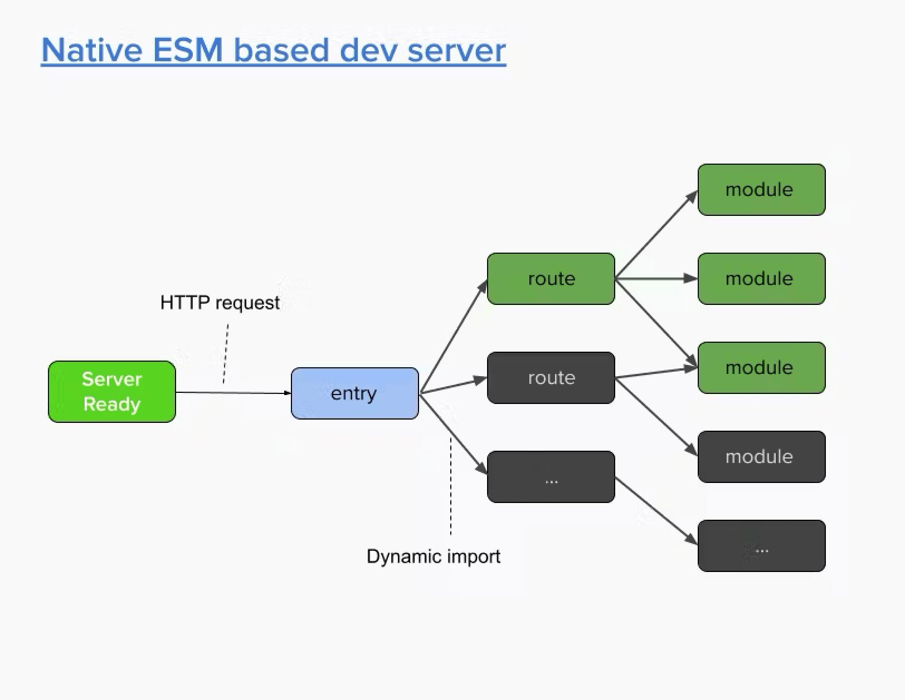

# webpack vs vite

## Webpack 底层


- 为了交构建应用序，Webpack 必须抓取、处理和连接整个 JavaScript 文件，因为它是基于捆绑器的构建工具
- 对于依赖项和应用程序代码来说都是如此。即使启用了 HMR，更改也可能需要十秒钟才能显示在浏览器中，因为当您保存文件时，Webpack 会重建整个 JavaScript 包。
- 由于 Webpack 的延迟反馈循环，开发大型 JavaScript 应用程序将需要开发人员付出大量工作

## vite 底层



- 与 Webpack 等基于捆绑器的工作流程不同，Webpack 必须处理所有 JavaScript 模块，而 Vite 仅在单个浏览器请求之前处理您的依赖模块

## 理念差异

- Webpack 和 Vite 作为现代 Web 应用程序的构建工具，都强调了可扩展性和社区支持的重要性。它们都通过插件系统赋予开发者强大的自定义功能。

- Vite 的核心理念在于精简和高效性，它拥`抱现代浏览器原生支持 ES 模块`的能力，实现`快速启动、热更新`等特性，以提供极致的开发体验。Vite 通过与 Rollup 结合，保持核心小巧且易于维护，并鼓励建立一个兼容且繁荣的插件生态系统。

- 相比之下，Webpack 更侧重于全面性和灵活性，为各种规模和复杂度的项目提供了高度定制化的构建流程。Webpack 引入了一种`通用模块化方法论`，将所有类型的资源视为模块处理，并允许使用各种导入声明和加载器来表达依赖关系。这使得 Webpack 成为了大型或具有特定需求项目的理想选择。

- 总的来说，Vite 是为现代前端开发环境量身打造的轻量级工具，注重实时反馈和简化配置；而 Webpack 则是全能型的构建解决方案，适用于需要深度定制和优化的场景。尽管两者理念有所不同，但都在各自领域中推动着 Web 开发技术的发展和进步。

## 流行度、社区和生态系统

- Vite 是一个新人，于 2020 年首次亮相。尽管 Vite 存在的时间相对较短，但它很快就受到了关注，使其成为现代 Web 开发领域的一个有前途的参与者。

- 相比之下，Webpack 成立于 2012 年，拥有显着的领先优势。它在行业中的时间使其能够发展出成熟的生态系统和强大的社区

## 配置及易用性

- Vite 和 Webpack 都提供了大量的配置选项，可以根据您的特定需求定制您的包

### Vite 精简配置

- Vite 以其零配置理念脱颖而出, 另外神奇之处在于它能够`自动检测大多数项目的正确设置`，以下是此类项目的简单 Vite 配置：

```javascript
import { defineConfig } from "vite";
import vue from "@vitejs/plugin-vue";

export default defineConfig({
  plugins: [vue()],
});
```

### Webpack 的配置复杂度

- Webpack 往往需要更详细的配置。尽管它在最近的版本中已经转向零配置方法，但它并不像 Vite 那样自动

```javascript
const webpack = require("webpack");
const path = require("path");
const { HotModuleReplacementPlugin } = require("webpack");
const { VueLoaderPlugin } = require("vue-loader");

module.exports = {
  entry: "./src/main.js",
  output: {
    path: path.resolve(__dirname, "./build"),
    filename: "bundle.js",
  },
  module: {
    rules: [
      {
        test: /.js$/,
        exclude: /(node_modules|bower_components)/,
        use: {
          loader: "babel-loader",
          options: {
            presets: ["@babel/preset-env"],
          },
        },
      },
      {
        test: /.vue$/,
        use: {
          loader: "vue-loader",
        },
      },
      {
        test: /.css$/,
        use: ["vue-style-loader", "css-loader"],
      },
    ],
  },
  resolve: {
    alias: {
      vue: "vue/dist/vue.js",
    },
  },
  plugins: [new HotModuleReplacementPlugin(), new VueLoaderPlugin()],
};
```

- 与 Vite 相比，Webpack 的配置需要更多的手动设置。复杂性包括指定入口和输出路径、为不同文件类型配置加载器以及为特定功能设置插件

- 总之，Vite 更适合追求快速迭代和轻量级配置的现代前端开发者，尤其在较小规模的项目上体现出了优势；而 Webpack 则更适合那些需要深度定制构建流程和处理复杂场景的专业团队，其强大的配置能力和丰富的生态系统确保了它在大型项目中的广泛应用。

## 启动速度

- Vite 通过一种完全不同的方法彻底改变了冷启动，极大地减少了初始化时间

  - `高效的依赖处理`：Vite 利用 esbuild （一个基于 Go 的高性能捆绑器）来预捆绑依赖项，包括纯 JavaScript 和大型模块。所有这些都极大地有助于更快的服务器启动。作为预捆绑过程的一部分，Vite 通过将具有众多内部模块的 ESM 依赖项合并到单个模块中来优化性能。例如，lodash-es 包含超过 600 个内部模块。当使用传统方法并导入类似 的函数时 debounce，会触发 600+ HTTP 请求。Vite 的解决方案是预先捆绑 lodash-es 成单个模块，将 HTTP 请求减少到一次。请求的大幅减少显着提高了开发服务器中的页面加载速度

  - `按需源代码加载`： Vite 利用原生 ES 模块来提供源代码，最大限度地减少服务器负载和延迟。源代码转换和服务根据浏览器请求进行，从而提高了效率并减少了等待时间。

- 另一方面，Webpack 采用基于捆绑的方法，预先捆绑源代码和依赖项，从而延长了开发过程中服务器的启动时间。相比于 Vite 的高效初始化，Webpack 的服务器搭建时间本质上较长
- 注意：当用户需要`额外数据、CSS 和资源`，Vite 的按需加载方式可能会带来轻微的延迟。如果这些资源需要进一步的捆绑步骤，这一点尤其值得注意。相反，Webpack 的策略确保所有站点数据可用，从而使浏览器更快地导航到开发服务器内的新页面

## HMR（模块热更换）

- Vite 在本机 ESM 上采用 HMR，通过将一些捆绑工作卸载到浏览器来减少服务器负载和延迟。这确保了快速更新而无需重新加载整页，这对于开发过程中的实时反馈至关重要。

- Webpack 还支持 HMR，支持实时更新并在开发过程中保留应用程序状态。然而，利用原生 ES 模块的潜在限制可能会导致更高的服务器负载和延迟。

## 缓存性能

缓存对于提高 Web 应用程序性能、通过重用存储的资源来减少负载和构建时间至关重要。

- Vite 中的缓存通过文件系统缓存进行管理，根据 package.json、 lockfiles 和 vite.config.js 的更改更新依赖项。它通过缓存已解析的依赖项请求来优化页面重新加载。

- Webpack 也使用文件系统缓存，在监视模式下清除修改的文件，并在非监视模式下每次编译前清除缓存，需要自定义配置以获得最佳缓存。

## 构建优化

- 在优化现代 Web 开发中的构建过程时，Vite 和 Webpack 提供了不同的方法，每种方法都有自己的一套特性和功能

## 预加载指令生成

- Vite 自动生成`<link rel="modulepreload">`条目块的指令并在构建的 HTML 中直接导入它们

```html
<link rel="modulepreload" href="/module-a.js" />
```

- 在 Webpack 中，为了实现资源的预加载（preload）或预获取（prefetch），开发者可以利用内联注释语法来指导 Webpack 生成相应的`<link>`标签

```javascript
import(/* webpackPreload: true */ "/module-a.js");
```

这将输出：

```html
<!-- Webpack - Manual Module Preloading -->
<link rel="preload" as="script" href="/module-a.js" />
```

### CSS 代码分割

- 在 Vite 中，CSS 代码分割是通过其内置机制实现的，当检测到异步模块导入了 CSS 文件时，Vite 会自动将这些 CSS 内容提取并生成单独的 CSS 文件。这意味着，在动态导入 JavaScript 模块的同时，对应的 CSS 也会作为单独的资源加载，并且会在适当的时候（确保 CSS 已加载）执行异步模块以防止无样式内容闪现（FOUC）。开发人员只需正常地导入 CSS 文件，无需额外配置。

- 而在 Webpack 中，CSS 代码分割需要配合 mini-css-extract-plugin 这样的插件来实现。这个插件允许 Webpack 将 CSS 从 JS bundle 中分离出来，并为每个包含 CSS 的入口点或拆分点生成单独的 CSS 文件。为了启用 CSS 代码分割，开发者需要在 Webpack 配置文件中安装并配置

```javascript
const MiniCssExtractPlugin = require("mini-css-extract-plugin");

module.exports = {
  // ...
  module: {
    rules: [
      {
        test: /\.css$/,
        use: [
          MiniCssExtractPlugin.loader, // 将CSS提取到单独的文件
          "css-loader", // 解析CSS中的import和url()
        ],
      },
      // 其他规则...
    ],
  },
  plugins: [
    new MiniCssExtractPlugin({
      filename: "[name].css", // 设置输出的CSS文件名
      chunkFilename: "[id].css", // 对于异步块的CSS文件名设置
    }),
    // 其他插件...
  ],
  // ...
};
```

## 代码分割和块加载

## Tree-Shaking

## 静态资源处理

## 服务器端渲染支持

## Vue.js and JSX Support

## 参考文献

- https://kinsta.com/blog/vite-vs-webpack/
