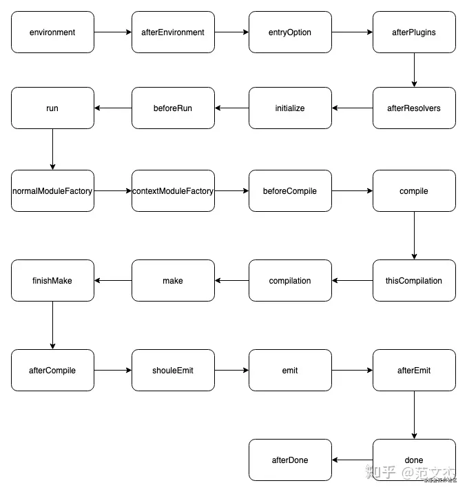
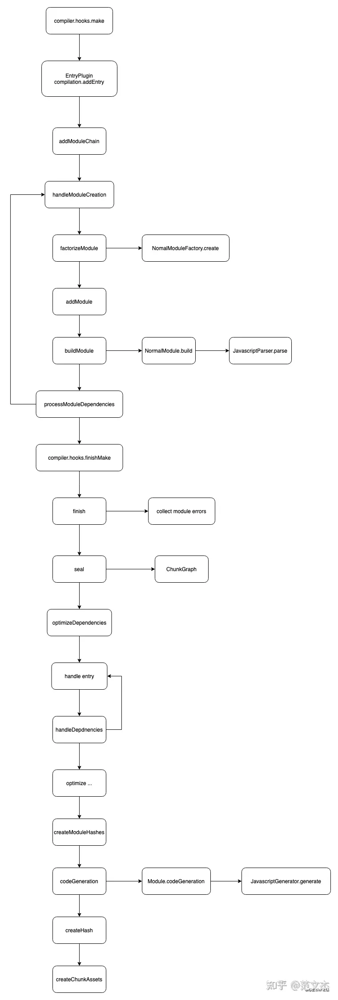

# Webpack 核心原理

Webpack 最核心的功能: 将各种类型的资源，包括图片、css、js 等，转译、组合、拼接、生成 JS 格式的 bundler 文件

`webpack 三大的体系知识：`

- 构建的核心流程
- loader 的作用
- plugin 架构与常用套路

`webpack 两大核心对象`

- `Compiler`：webpack 从开始执行到结束，Compiler 只会实例化一次。`compiler 对象记录了 webpack 运行环境的所有的信息`，插件可以通过它获取到 webpack 的配置信息，如 entry、output、module 等配置

- `Compilation`：提供了 webpack 大部分生命周期 Hook API 供自定义处理时做拓展使用。一个 `compilation 对象记录了一次构建到生成资源过程中的信息`，它储存了当前的模块资源、编译生成的资源、变化的文件、以及被跟踪依赖的状态信息

## 构建的核心流程

这个过程核心完成了 内容转换 + 资源合并 两种功能

### 初始化阶段：

1. `初始化参数`：从配置文件、 配置对象、Shell 参数中读取，与默认配置结合得出最终的参数
2. `创建编译器对象`：用上一步得到的参数创建 Compiler 对象
3. `初始化编译环境`：包括注入内置插件、注册各种模块工厂、初始化 RuleSet 集合、加载配置的插件等
4. `开始编译`：执行 compiler 对象的 run 方法
5. `确定入口`：根据配置中的 entry 找出所有的入口文件，调用 compilition.addEntry 将入口文件转换为 dependence 对象

### 构建阶段

1. `编译模块(make)`：根据 entry 对应的 dependence 创建 module 对象，调用 loader 将模块转译为标准 JS 内容，调用 JS 解释器将内容转换为 AST 对象，从中找出该模块依赖的模块，再递归 本步骤直到所有入口依赖的文件都经过了本步骤的处理
2. `完成模块编译`：上一步递归处理所有能触达到的模块后，得到了每个模块被翻译后的内容以及它们之间的依赖关系图

### 生成阶段

1. `输出资源(seal)`：根据入口和模块之间的依赖关系，组装成一个个包含多个模块的 Chunk，再把每个 Chunk 转换成一个单独的文件加入到输出列表，这步是可以修改输出内容的最后机会
2. `写入文件系统(emitAssets)`：在确定好输出内容后，根据配置确定输出的路径和文件名，把文件内容写入到文件系统

## loader 体系

loader 集合读取、转译资源，此前的内容可以千奇百怪，
但转译之后理论上应该输出标准 JavaScript 文本或者 AST 对象，webpack 才能继续处理模块依赖

## plugin 体系

### 问题 1:什么是插件：`插件通常是一个带有 apply 函数的类`

### 问题 2:什么时间点会有什么钩子被触发：

- compiler 对象逐次触发如下钩子

| 钩子名称                    | 描述                                                         |
| --------------------------- | ------------------------------------------------------------ |
| `environment`               | 在开始读取 Webpack 配置文件之前触发                          |
| `afterEnvironment`          | 在读取并解析完 Webpack 配置文件之后触发                      |
| `entryOption`               | 在处理入口配置项（entry options）之前触发                    |
| `beforeRun`                 | 在运行 compiler 之前触发，所有插件的 `apply` 方法调用后      |
| `run`                       | 开始编译主流程，在此阶段会创建 Compilation 对象              |
| `watch-run` (监听模式)      | 当源代码发生变化并重新编译时触发                             |
| `normal-module-factory`     | 创建 NormalModuleFactory，用于处理模块加载逻辑的插件非常有用 |
| `before-compile`            | 在创建 Compilation 对象之前触发                              |
| `compile`                   | 创建 Compilation 对象                                        |
| `make` 或 `thisCompilation` | 新 Compilation 对象创建后立即触发，进行资源和模块处理        |
| `after-compile`             | 完成一次 Compilation 过程后触发                              |
| `should-emit`               | 决定是否应该将编译结果写入硬盘                               |
| `emit`                      | 在编译结果准备输出到硬盘前触发，可以修改或替换输出内容       |
| `after-emit`                | 在编译结果成功输出到硬盘后触发，常用于清理工作或其他后期处理 |
| `done`                      | 整个编译过程完成后触发，不论是否有错误发生                   |
| `failed`                    | 如果编译过程中出现错误，则触发此钩子                         |

  <!--  -->

- compilation 对象逐次触发:

| 钩子名称                          | 描述                                         |
| --------------------------------- | -------------------------------------------- |
| `build-module`                    | 当一个模块开始构建时触发                     |
| `normal-module-loader`            | 当使用普通加载器加载模块时触发               |
| `module-asset`                    | 每当一个模块添加资产到 compilation 时触发    |
| `optimize-module-order`           | 优化模块顺序之前触发                         |
| `optimize-modules-basic`          | 基础模块优化阶段触发                         |
| `optimize-module-ids`             | 为模块分配唯一标识符（ID）时触发             |
| `after-optimize-module-ids`       | 在模块 ID 优化完成后触发                     |
| `optimize-chunk-ids`              | 为 chunk 分配唯一标识符时触发                |
| `after-optimize-chunk-ids`        | 在 chunk ID 优化完成后触发                   |
| `record-modules`                  | 记录所有模块信息前触发                       |
| `record-chunks`                   | 记录所有 chunk 信息前触发                    |
| `before-hash`                     | 在计算 compilation 的 hash 值之前触发        |
| `content-hash`                    | 当计算内容相关 hash 值时触发                 |
| `after-hash`                      | 在计算完成 compilation 的 hash 值后触发      |
| `optimize-chunk-assets`           | 在优化 chunk 资产之前触发                    |
| `optimize-assets`                 | 在优化所有资产之前触发                       |
| `additional-chunk-assets`         | 在额外的 chunk 资产被加入 compilation 后触发 |
| `additional-assets`               | 在其他额外资产被加入 compilation 后触发      |
| `need-additional-pass`            | 如果需要再次处理 compilation，则在此触发     |
| `before-seal`                     | 在 seal（封闭）compilation 过程之前触发      |
| `optimize`                        | 在执行最终优化步骤前触发                     |
| `after-optimize`                  | 在执行完所有的优化步骤之后触发               |
| `seal`                            | 在 compilation 封闭（不可再修改）时触发      |
| `chunk-graph`                     | 当 chunk 图谱可用时触发                      |
| `after-seal`                      | 在 compilation 完全封闭后触发                |
| `optimize-tree-chunk`             | 用于 tree shaking 的 chunk 级别优化          |
| `optimize-tree-module`            | 用于 tree shaking 的模块级别优化             |
| `after-optimizing`                | 在所有优化操作完成后触发                     |
| `revive-modules`                  | 在模块从缓存恢复后触发                       |
| `optimize-module-factory`         | 优化模块工厂创建过程时触发                   |
| `optimize-module-factories`       | 在所有模块工厂优化完成后触发                 |
| `before-module-ids`               | 在给模块分配 id 之前触发                     |
| `module-id`                       | 每个模块 id 被确定时触发                     |
| `after-module-ids`                | 在所有模块 id 分配完毕后触发                 |
| `revive-chunks`                   | 在 chunks 从缓存恢复后触发                   |
| `optimize-chunks-basic`           | 基本的 chunk 优化阶段触发                    |
| `optimize-extracted-chunks`       | 优化提取出的 chunks 时触发                   |
| `after-optimize-extracted-chunks` | 在优化提取出的 chunks 完成后触发             |
| `optimize-chunk-contents`         | 优化 chunk 内容时触发                        |
| `before-hash-for-chunk`           | 在计算单个 chunk 的 hash 值之前触发          |
| `async`                           | 在异步任务完成后触发                         |
| `child-compiler`                  | 子 compiler 创建时触发                       |

<!--  -->

### 问题 3:如何影响编译状态

webpack 的插件体系与平常所见的 订阅/发布 模式差别很大，
是一种非常强耦合的设计，hooks 回调由 webpack 决定何时，以何种方式执行；
而在 hooks 回调内部可以通过修改状态、调用上下文 api 等方式对 webpack 产生 side effect。

## 参考文献

- https://zhuanlan.zhihu.com/p/363928061
- https://mp.weixin.qq.com/s/SbJNbSVzSPSKBe2YStn2Zw
