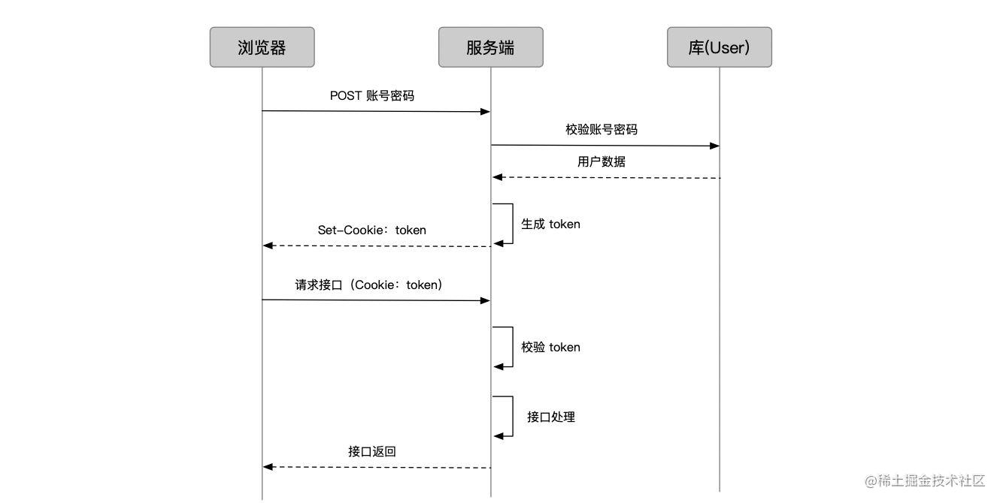
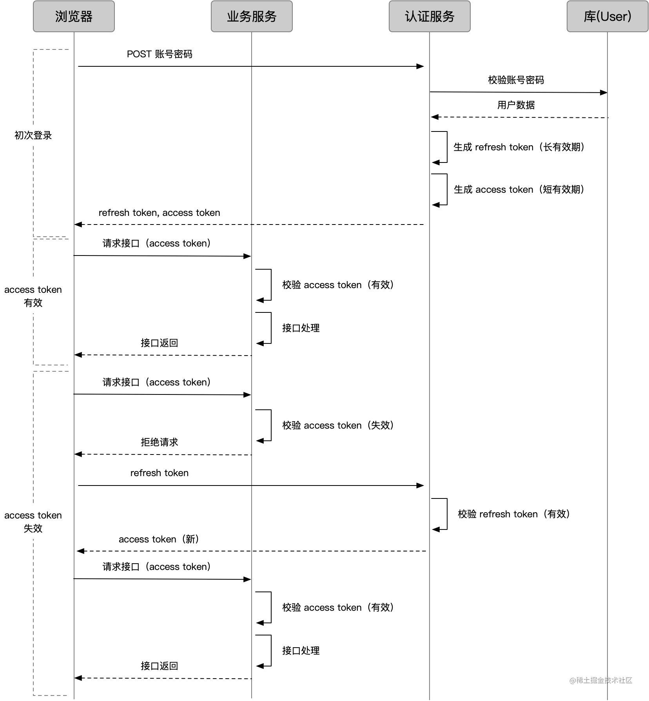
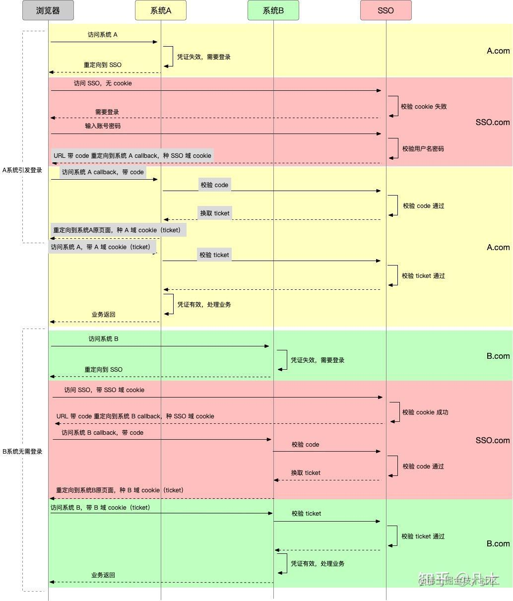

# 前端鉴权

## Basic Access Authentication

- 基本上被废弃的方案
- https://zhuanlan.zhihu.com/p/64584734

> 过程

- 客户端访问资源 family
- 服务端响应 header `www-Authenticate: Basic realm= "family"` 告诉客户端需要输入这个安全区的用户名和密码
- 客户端会弹出密码框，输入密码，然后 base64 加密信息，响应 `Authorization: Basic base64加密之后密文`
- 服务端认真通过响应资源

## cookies-session

> Session 的存储方式 (服务端只是给 cookie 一个 sessionId，而 session 的具体内容要自己存一下)

1. Redis（推荐）：内存型数据库，以 key-value 的形式存，正合 sessionId-sessionData 的场景；且访问快。
2. 内存：直接放到变量里。一旦服务重启就没了
3. 数据库：普通数据库。性能不高。

> Session 的过期和销毁

- 只要把存储的 session 数据销毁就可以

> Session 的分布式问题

- 通常服务端是集群，而用户请求过来会走一次负载均衡，不一定打到哪台机器上。那一旦用户后续接口请求到的机器和他登录请求的机器不一致，或者登录请求的机器宕机了，session 就失效了

1. 一是从「存储」角度，把 session 集中存储。
2. 二是从「分布」角度，让相同 IP 的请求在负载均衡时都打到同一台机器上。

## token

> 出现背景

- session 的维护给服务端造成很大困扰，我们必须找地方存放它，又要考虑分布式的问题，甚至要单独为了它启用一套 Redis 集群; token 每次只要核验 cookie 带的「证件」有效性就可以了，在 cookies 携带一些轻量的信息

> 存在的问题

- 容易被篡改，解决方案就是给 token 加签名，来识别 token 是否被篡改过， 于是就有 JWT （它是一种成熟的 token 字符串生成方案，包含了我们前面提到的数据、签名）

- 安全性，防止被盗用；refresh token 应运而生
  1. access token 用来访问业务接口，由于有效期足够短，盗用风险小，也可以使请求方式更宽松灵活
  2. refresh token 用来获取 access token，有效期可以长一些，通过独立服务和严格的请求方式增加安全性；由于不常验证，也可以如前面的 session 一样处理

## 单点登录

- 多业务场景下的「一次登录，全线通用」的能力，叫做「单点登录」

> “虚假”的单点登录（一级域名相同）

- 业务系统都在同一一级域名下，比如 wenku.baidu.com tieba.baidu.com，就好办了。可以直接把 cookie domain 设置为一级域名 baidu.com
- “真实”的单点登录（一级域名不同）
- 

参考链接：https://zhuanlan.zhihu.com/p/281414244

## OAuth

- OAuth 就是一种授权机制。数据的所有者告诉系统，同意授权第三方应用进入系统，获取这些数据。系统从而产生一个短期的进入令牌（token），用来代替密码，供第三方应用使用

参考链接：

1. https://ruanyifeng.com/blog/2019/04/github-oauth.html
2. http://www.ruanyifeng.com/blog/2019/04/oauth-grant-types.html
