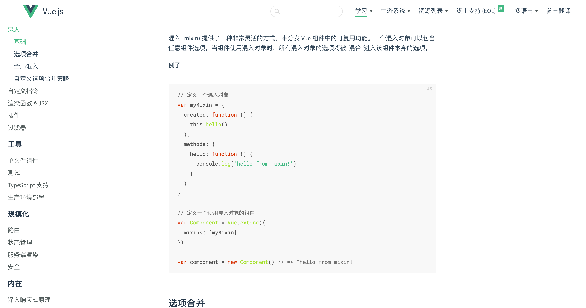

# mixin

## mixin 是什么

混入 (mixin) 提供了一种非常灵活的方式，来`分发 Vue 组件中的可复用功能`。一个混入对象可以包含任意组件选项。当组件使用混入对象时，所有混入对象的选项将被“混合”进入该组件本身的选项。



## mixin 解决了什么问题

- 案例：假设我们有一些不同的组件, 它们的工作是切换状态 boolean, 一个模态(modal)和一个提示(tooltip). 这些 tooltips 和 modals 没有很多共同之处, 除了这个功能: 它们看起来不一样, 它们使用起来也不尽相同, 但是它们的逻辑是相似的

```javascript
// modal
const Modal = {
  template: "#modal",
  data() {
    return {
      isShowing: false,
    };
  },
  methods: {
    toggleShow() {
      this.isShowing = !this.isShowing;
    },
  },
};

// tooltip
const Tooltip = {
  template: "#tooltip",
  data() {
    return {
      isShowing: false,
    };
  },
  methods: {
    toggleShow() {
      this.isShowing = !this.isShowing;
    },
  },
};
```

### 提取逻辑, 并创建可以复用的部分

```javascript
const toggle = {
  data() {
    return {
      isShowing: false,
    };
  },
  methods: {
    toggleShow() {
      this.isShowing = !this.isShowing;
    },
  },
};

const Modal = {
  template: "#modal",
  mixins: [toggle],
};

const Tooltip = {
  template: "#tooltip",
  mixins: [toggle],
};
```

## mixin 原理

- [mixin 入口](https://github.com/vuejs/vue/blob/v2.6.14/src/core/global-api/mixin.js)

```javascript
export function initMixin(Vue: GlobalAPI) {
  Vue.mixin = function (mixin: Object) {
    this.options = mergeOptions(this.options, mixin);
    return this;
  };
}
```

- [merOptions 方法](https://github.com/vuejs/vue/blob/v2.6.14/src/core/util/options.js)

```javascript
export function mergeOptions(
  parent: Object,
  child: Object,
  vm?: Component
): Object {
  if (child.mixins) {
    // 判断有没有mixin 也就是mixin里面挂mixin的情况 有的话递归进行合并
    for (let i = 0, l = child.mixins.length; i < l; i++) {
      parent = mergeOptions(parent, child.mixins[i], vm);
    }
  }

  const options = {};
  let key;
  for (key in parent) {
    mergeField(key); // 先遍历parent的key 调对应的strats[XXX]方法进行合并
  }
  for (key in child) {
    if (!hasOwn(parent, key)) {
      // 如果parent已经处理过某个key 就不处理了
      mergeField(key); // 处理child中的key 也就parent中没有处理过的key
    }
  }
  function mergeField(key) {
    const strat = strats[key] || defaultStrat;
    options[key] = strat(parent[key], child[key], vm, key); // 根据不同类型的options调用strats中不同的方法进行合并
  }
  return options;
}
```

从上面的源码，我们得到以下几点：

- 优先递归处理 mixins
- 先遍历合并 parent 中的 key，调用 mergeField 方法进行合并，然后保存在变量 options
- 再遍历 child，合并补上 parent 中没有的 key，调用 mergeField 方法进行合并，保存在变量 options
- 通过 mergeField 函数进行了合并

## 合并策略

### 替换型

- 替换型合并有 props、methods、inject、computed
- 子类型的数据会覆盖父类型数据；同名的 props、methods、inject、computed 会被后来者代替

```javascript
strats.props =
  strats.methods =
  strats.inject =
  strats.computed =
    function (
      parentVal: ?Object,
      childVal: ?Object,
      vm?: Component,
      key: string
    ): ?Object {
      if (!parentVal) return childVal; // 如果parentVal没有值，直接返回childVal

      const ret = Object.create(null); // 创建一个第三方对象 ret

      extend(ret, parentVal); // extend方法实际是把parentVal的属性复制到ret中

      if (childVal) extend(ret, childVal); // 把childVal的属性复制到ret中
      return ret;
    };
strats.provide = mergeDataOrFn;
```

### 合并型

- 和并型合并有：data

```js
strats.data = function (parentVal, childVal, vm) {
  return mergeDataOrFn(parentVal, childVal, vm);
};

function mergeDataOrFn(parentVal, childVal, vm) {
  return function mergedInstanceDataFn() {
    var childData = childVal.call(vm, vm); // 执行data挂的函数得到对象
    var parentData = parentVal.call(vm, vm);
    if (childData) {
      return mergeData(childData, parentData); // 将2个对象进行合并
    } else {
      return parentData; // 如果没有childData 直接返回parentData
    }
  };
}

function mergeData(to, from) {
  if (!from) return to;
  var key, toVal, fromVal;
  var keys = Object.keys(from);
  for (var i = 0; i < keys.length; i++) {
    key = keys[i];
    toVal = to[key];
    fromVal = from[key];
    // 如果不存在这个属性，就重新设置
    if (!to.hasOwnProperty(key)) {
      set(to, key, fromVal);
    }
    // 存在相同属性，合并对象
    else if (typeof toVal == "object" && typeof fromVal == "object") {
      mergeData(toVal, fromVal);
    }
  }
  return to;
}
```

- 当目标 data 对象不包含当前属性时，调用 set 方法进行合并（set 方法其实就是一些合并重新赋值的方法）
- 当目标 data 对象包含当前属性并且当前值为纯对象时，递归合并当前对象值，这样做是为了防止对象存在新增属性

### 队列型

- 队列性合并有：全部生命周期和 watch

```js
function mergeHook(
  parentVal: ?Array<Function>,
  childVal: ?Function | ?Array<Function>
): ?Array<Function> {
  return childVal
    ? parentVal
      ? parentVal.concat(childVal)
      : Array.isArray(childVal)
      ? childVal
      : [childVal]
    : parentVal;
}

LIFECYCLE_HOOKS.forEach((hook) => {
  strats[hook] = mergeHook;
});

// watch
strats.watch = function (parentVal, childVal, vm, key) {
  // work around Firefox's Object.prototype.watch...
  if (parentVal === nativeWatch) {
    parentVal = undefined;
  }
  if (childVal === nativeWatch) {
    childVal = undefined;
  }
  /* istanbul ignore if */
  if (!childVal) {
    return Object.create(parentVal || null);
  }
  {
    assertObjectType(key, childVal, vm);
  }
  if (!parentVal) {
    return childVal;
  }
  var ret = {};
  extend(ret, parentVal);
  for (var key$1 in childVal) {
    var parent = ret[key$1];
    var child = childVal[key$1];
    if (parent && !Array.isArray(parent)) {
      parent = [parent];
    }
    ret[key$1] = parent
      ? parent.concat(child)
      : Array.isArray(child)
      ? child
      : [child];
  }
  return ret;
};
```

- 生命周期钩子和 watch 被合并为一个数组，然后正序遍历一次执行

### 叠加型

- 叠加型合并有：component、directives、filters

```js
strats.components =
  strats.directives =
  strats.filters =
    function mergeAssets(parentVal, childVal, vm, key) {
      var res = Object.create(parentVal || null);
      if (childVal) {
        for (var key in childVal) {
          res[key] = childVal[key];
        }
      }
      return res;
    };
```

- 叠加型主要是通过原型链进行层层的叠加

## mixin 总结：

- 替换型策略：有 props、methods、inject、computed，就是将新的同名参数替代旧的参数
- 合并型策略：是 data, 通过 set 方法进行合并和重新赋值
- 队列型策略：有生命周期函数和 watch，原理是将函数存入一个数组，然后正序遍历依次执行
- 叠加型有：component、directives、filters，通过原型链进行层层的叠加

## 参考文献

https://v2.cn.vuejs.org/v2/guide/mixins.html
