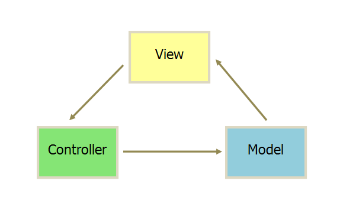
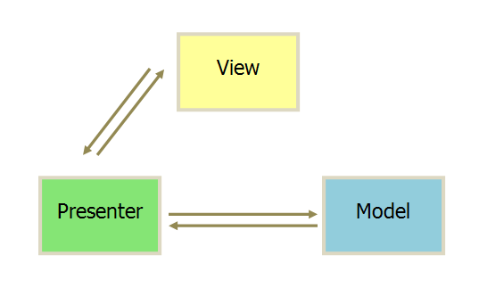

# MVC，MVP 和 MVVM

## MVC

> 视图（View）：用户界面  
> 控制器（Controller）：业务逻辑  
> 模型（Model）：数据保存

- 通信方式如下

> View 传送指令到 Controller  
> Controller 完成业务逻辑后，要求 Model 改变状态 
> Model 将新的数据发送到 View，用户得到反馈

### 互动方式

## MVP

- MVP 模式将 Controller 改名为 Presenter，同时改变了通信方向。

> 各部分之间的通信，都是双向的。 
> View 与 Model 不发生联系，都通过 Presenter 传递。 
> View 非常薄，不部署任何业务逻辑，称为"被动视图"（Passive View），即没有任何主动性，而 Presenter 非常厚，所有逻辑都部署在那里。

## MVVM

- MVVM 模式将 Presenter 改名为 ViewModel，`基本上与 MVP 模式完全一致`。

- 唯一的区别是，它采用`双向绑定（data-binding）：View的变动，自动反映在 ViewModel，`反之亦然

## 参考文献

- https://www.ruanyifeng.com/blog/2015/02/mvcmvp_mvvm.html
