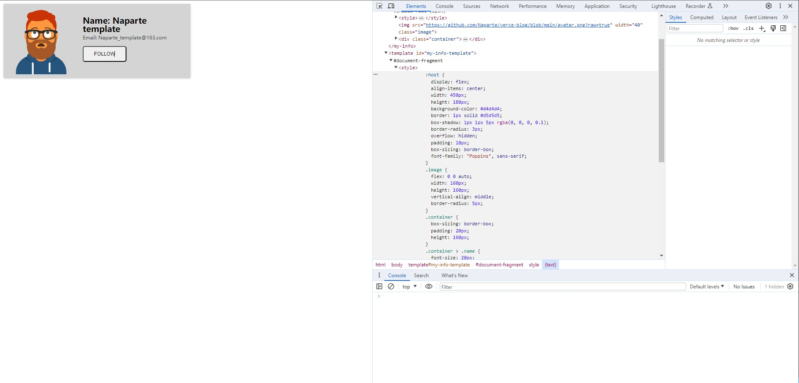

# Web Component

## 官方解释

- Web Component 是一套不同的技术，允许你创建可重用的定制元素（它们的功能封装在你的代码之外）并且在你的 web 应用中使用它们

## Js 自定义标签

```html
<!DOCTYPE html>
<html lang="en">
  <head>
    <meta charset="UTF-8" />
    <meta name="viewport" content="width=device-width, initial-scale=1.0" />
    <title>Document</title>
  </head>
  <body>
    <div>
      <user-card></user-card>
    </div>
  </body>
  <script>
    class MyInfoTag extends HTMLElement {
      constructor() {
        super();

        var image = document.createElement("img");
        image.src =
          "https://github.com/Naparte/verce-blog/blob/main/avatar.png?raw=true";
        image.width = 40;
        image.classList.add("image");

        var container = document.createElement("div");
        container.classList.add("container");

        var name = document.createElement("p");
        name.classList.add("name");
        name.innerText = "Name: Naparte";

        var email = document.createElement("p");
        email.classList.add("email");
        email.innerText = "Email: Naparte@163.com";

        var button = document.createElement("button");
        button.classList.add("button");
        button.innerText = "Follow";

        container.append(name, email, button);
        this.append(image, container);
      }
    }
    window.customElements.define("my-info", MyInfoTag);
  </script>
</html>
```

- [在线预览地址](https://code.juejin.cn/pen/7309378120925052937)
- 

## `<template>`标签

- 使用 JavaScript 写上一节的 DOM 结构很麻烦，Web Components API 提供了`<template>`标签，可以在它里面使用 HTML 定义 DOM

```html
<!DOCTYPE html>
<html lang="en">
  <head>
    <meta charset="UTF-8" />
    <meta name="viewport" content="width=device-width, initial-scale=1.0" />
    <title>Document</title>
  </head>
  <body>
    <my-info></my-info>

    <template id="my-info-template">
      <style>
        :host {
          display: flex;
          align-items: center;
          width: 450px;
          height: 180px;
          background-color: #d4d4d4;
          border: 1px solid #d5d5d5;
          box-shadow: 1px 1px 5px rgba(0, 0, 0, 0.1);
          border-radius: 3px;
          overflow: hidden;
          padding: 10px;
          box-sizing: border-box;
          font-family: "Poppins", sans-serif;
        }
        .image {
          flex: 0 0 auto;
          width: 160px;
          height: 160px;
          vertical-align: middle;
          border-radius: 5px;
        }
        .container {
          box-sizing: border-box;
          padding: 20px;
          height: 160px;
        }
        .container > .name {
          font-size: 20px;
          font-weight: 600;
          line-height: 1;
          margin: 0;
          margin-bottom: 5px;
        }
        .container > .email {
          font-size: 12px;
          opacity: 0.75;
          line-height: 1;
          margin: 0;
          margin-bottom: 15px;
        }
        .container > .button {
          padding: 10px 25px;
          font-size: 12px;
          border-radius: 5px;
          text-transform: uppercase;
        }
      </style>
      
      <div class="container">
        <p class="name">Name: Naparte template</p>
        <p class="email">Email: Naparte_template@163.com</p>
        <button class="button">Follow</button>
      </div>
    </template>
  </body>
  <script>
    class MyInfo extends HTMLElement {
      constructor() {
        super();

        var templateElem = document.getElementById("my-info-template");
        var content = templateElem.content.cloneNode(true);

        //  :host CSS 伪类选择内部使用了该 CSS 的影子 DOM（shadow DOM） 的影子宿主（shadow host）——换句话说，这允许你从其影子 DOM 内部选择自定义元素
        // https://developer.mozilla.org/zh-CN/docs/Web/CSS/:host
        const shadowRoot = this.attachShadow({ mode: "open" });
        shadowRoot.appendChild(content);

        // 添加操作事件
        this.$button = shadowRoot.querySelector("button");
        this.$button.addEventListener("click", () => {
          alert("click");
        });
      }
    }

    window.customElements.define("my-info", MyInfo);
  </script>
</html>
```

- [在线地址](https://code.juejin.cn/pen/7309385178093355059)
- 

## 参考文献

- https://www.ruanyifeng.com/blog/2019/08/web_components.html
- https://www.robinwieruch.de/web-components-tutorial/
