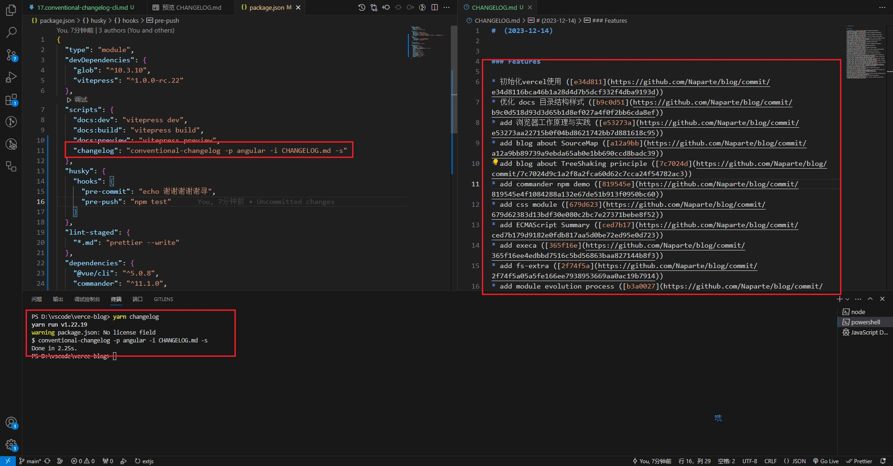

# conventional-changelog-cli

## conventional-changelog-cli 是什么 ？

- 官方解释： Generate a changelog from git metadata （从 git 元数据生成变更日志）

- conventional-changelog-cli 是一个用于生成遵循约定式提交规范（Conventional Commits）的变更日志的命令行工具

> 约定式提交规范（Conventional Commits）

- 类型（Type）：表示提交的类型，如 feat（新功能）、fix（修复 bug）、docs（文档变更）等。
- 范围（Scope）：表示变更的范围，可以是某个模块、组件或功能的名称。
- 描述（Description）：对变更的简要描述。
- 约定式提交规范的好处在于它提供了一种结构化的提交消息格式，使得变更日志更易于自动化生成和解析。eg：feat: 添加用户登录功能

## conventional-changelog-cli 原理

- 通过解析代码库的提交历史，根据约定式提交规范生成变更日志。
- 它会遍历代码库的提交记录，根据提交消息中的类型、范围和描述等信息，
- 将每个提交归类到相应的变更类型中（如新功能、修复 bug、文档变更等），并按照一定的格式生成变更日志。

> 推荐的工作流

1. 进行更改
2. 提交这些更改
3. 确保 Travis 变为绿色（需消耗：构建和测试代码）
4. 在 package.json 中提升版本号
5. 运行 conventionalChangelog（需消耗：生成变更日志）
6. 提交 package.json 和 CHANGELOG.md 文件
7. 打标签
8. 推送

## conventional-changelog-cli API

| API                                                | 描述                                     |
| -------------------------------------------------- | ---------------------------------------- |
| `conventional-changelog`                           | 生成符合约定式提交规范的变更日志。       |
| `conventional-changelog -p <preset>`               | 根据指定的预设生成变更日志。             |
| `conventional-changelog -i <infile>`               | 指定输入的文件来生成变更日志。           |
| `conventional-changelog -s`                        | 将生成的变更日志追加到已存在的文件末尾。 |
| `conventional-changelog -r <releaseCount>`         | 指定从最近的提交开始生成变更日志的数量。 |
| `conventional-changelog --config <path>`           | 指定自定义配置文件的路径。               |
| `conventional-changelog --context <path>`          | 指定自定义上下文文件的路径。             |
| `conventional-changelog --lerna-package <package>` | 指定 Lerna 项目中的包名称。              |

## 使用方式

- conventional-changelog -p angular -i CHANGELOG.md -s

  

## 参考文献

- https://www.npmjs.com/package/conventional-changelog-cli
- https://github.com/conventional-changelog/conventional-changelog
