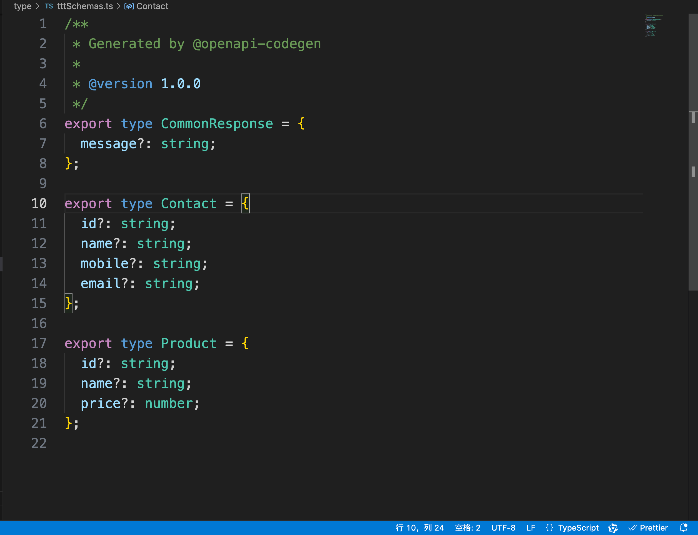

# openapi-codegen/typescript

## openapi-codegen/typescript 是什么？

- typescript 生成工具集合

## openapi-codegen/typescript 解决了什么问题

- `自动化代码生成`：为开发者提供了根据 OpenAPI 规范（Swagger）自动生成 TypeScript 类型安全的客户端或服务器端代码的能力，从而显著减少了手动编写与 API 相关接口、模型和请求处理逻辑的工作量

- `保持同步`：当 API 发生变化时，更新对应的 TypeScript 定义可以确保客户端或服务端代码始终反映最新的接口规范，减少因为文档与实现不同步而产生的问题

## openapi-codegen/typescript 的功能和特点

## 示例：


### 生成的 type 类型



```yml
openapi: 3.0.0
info:
  version: 1.0.0
  title: API validation using OpenAPI
paths:
  /contact:
    get:
      tags:
        - Contact
      summary: Get all the contacts
      description: Get all the contacts
      responses:
        "200":
          description: Contacts fetched successfully
          content:
            application/json:
              schema:
                type: array
                items:
                  $ref: "#/components/schemas/Contact"
        "400":
          description: Error in fetching contacts
          content:
            application/json:
              schema:
                $ref: "#/components/schemas/CommonResponse"
    post:
      tags:
        - Contact
      summary: Save a new contact
      description: Save a new contact
      requestBody:
        $ref: "#/components/requestBodies/Contact"
      responses:
        "200":
          description: Contact saved successfully
          content:
            application/json:
              schema:
                $ref: "#/components/schemas/CommonResponse"
        "400":
          description: Error in saving contact
          content:
            application/json:
              schema:
                $ref: "#/components/schemas/CommonResponse"
  "/contact/{id}":
    get:
      tags:
        - Contact
      summary: Get a contact
      description: Get a contact with the id specified in parameter
      parameters:
        - in: path
          name: id
          description: Contact id that needs to be fetched
          required: true
          schema:
            type: string
      responses:
        "200":
          description: Contact fetched successfully
          content:
            application/json:
              schema:
                $ref: "#/components/schemas/Contact"
        "400":
          description: Error in fetching contact
          content:
            application/json:
              schema:
                $ref: "#/components/schemas/CommonResponse"
    put:
      tags:
        - Contact
      summary: Update a contact
      description: Update a contact
      parameters:
        - in: path
          name: id
          description: Contact id that needs to be updated
          required: true
          schema:
            type: string
      requestBody:
        $ref: "#/components/requestBodies/Contact"
      responses:
        "200":
          description: Contact updated successfully
          content:
            application/json:
              schema:
                $ref: "#/components/schemas/CommonResponse"
        "400":
          description: Error in updating contact
          content:
            application/json:
              schema:
                $ref: "#/components/schemas/CommonResponse"
    delete:
      tags:
        - Contact
      summary: Delete a contact
      description: Delete a contact with the id specified in parameter
      parameters:
        - in: path
          name: id
          description: Contact id that needs to be deleted
          required: true
          schema:
            type: string
      responses:
        "200":
          description: Contact deleted successfully
          content:
            application/json:
              schema:
                $ref: "#/components/schemas/CommonResponse"
        "400":
          description: Error in deleting contact
          content:
            application/json:
              schema:
                $ref: "#/components/schemas/CommonResponse"
  /product:
    get:
      tags:
        - Product
      summary: Get all the products
      description: Get all the products
      responses:
        "200":
          description: Products fetched successfully
          content:
            application/json:
              schema:
                type: array
                items:
                  $ref: "#/components/schemas/Product"
        "400":
          description: Error in fetching products
          content:
            application/json:
              schema:
                $ref: "#/components/schemas/CommonResponse"
    post:
      tags:
        - Product
      summary: Save a new product
      description: Save a new product
      requestBody:
        $ref: "#/components/requestBodies/Product"
      responses:
        "200":
          description: Product saved successfully
          content:
            application/json:
              schema:
                $ref: "#/components/schemas/CommonResponse"
        "400":
          description: Error in saving product
          content:
            application/json:
              schema:
                $ref: "#/components/schemas/CommonResponse"
  "/product/{id}":
    get:
      tags:
        - Product
      summary: Get a product
      description: Get a product with the id specified in parameter
      parameters:
        - in: path
          name: id
          description: Product id that needs to be fetched
          required: true
          schema:
            type: string
      responses:
        "200":
          description: Product fetched successfully
          content:
            application/json:
              schema:
                $ref: "#/components/schemas/Product"
        "400":
          description: Error in fetching product
          content:
            application/json:
              schema:
                $ref: "#/components/schemas/CommonResponse"
    put:
      tags:
        - Product
      summary: Update a product
      description: Update a product
      parameters:
        - in: path
          name: id
          description: Product id that needs to be updated
          required: true
          schema:
            type: string
      requestBody:
        $ref: "#/components/requestBodies/Product"
      responses:
        "200":
          description: Product updated successfully
          content:
            application/json:
              schema:
                $ref: "#/components/schemas/CommonResponse"
        "400":
          description: Error in updating product
          content:
            application/json:
              schema:
                $ref: "#/components/schemas/CommonResponse"
    delete:
      tags:
        - Product
      summary: Delete a product
      description: Delete a product with the id specified in parameter
      parameters:
        - in: path
          name: id
          description: Product id that needs to be deleted
          required: true
          schema:
            type: string
      responses:
        "200":
          description: Product deleted successfully
          content:
            application/json:
              schema:
                $ref: "#/components/schemas/CommonResponse"
        "400":
          description: Error in deleting product
          content:
            application/json:
              schema:
                $ref: "#/components/schemas/CommonResponse"
servers:
  - url: http://localhost:3000/api
  - url: https://localhost:3000/api
components:
  requestBodies:
    Contact:
      content:
        application/json:
          schema:
            $ref: "#/components/schemas/Contact"
      description: Contact object
      required: true
    Product:
      content:
        application/json:
          schema:
            $ref: "#/components/schemas/Product"
      description: Product object
      required: true
  schemas:
    CommonResponse:
      type: object
      properties:
        message:
          type: string
    Contact:
      type: object
      properties:
        id:
          type: string
        name:
          type: string
        mobile:
          type: string
        email:
          type: string
    Product:
      type: object
      properties:
        id:
          type: string
        name:
          type: string
        price:
          type: number
```

## 参考文献

- https://github.com/fabien0102/openapi-codegen
