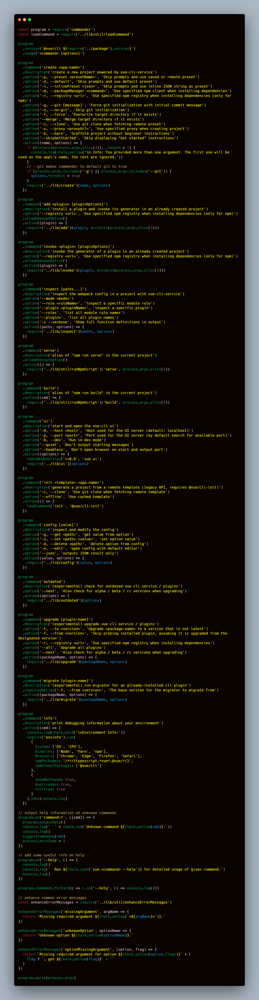

# commander

## 官方说明

- 编写代码来描述你的命令行界面。 Commander 负责将参数解析为选项和命令参数；node cli 命令行工具必备

## 使用场景

```javascript
import { Command } from "commander";
const program = new Command();

program
  .version("1.0.0")
  .description("一个简单的命令行工具")
  .option("--first") // 解析成布尔值
  .option("-s, --separator <char>") // -s 是简写，separator在options中是完整key
  .on("--help", () => {
    console.log("");
    console.log("示例命令:");
    console.log("node test.js -s / --first a/b/c");
  });

program.parse(process.argv);

const options = program.opts();

console.log(options);
// 命令行 node .\test.js --first firestarguement -s st  输出
// {
//   first: true,
//   separator: "st",
// }
```

## 独立命令行

```javascript
// 单独一个命令执行
program
  .command("serve")
  .argument("<script>")
  .option("-p, --port <number>", "port number", 80)
  .action(function () {
    console.error("Run script %s on port %s", this.args[0], this.opts().port);
  });

// 注意这句话一定要
program.parse(process.argv);
```

## vuecli commander

- 
