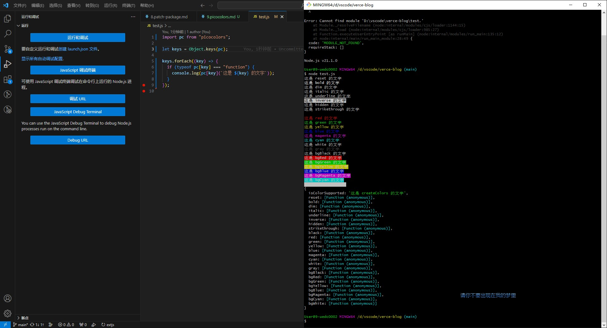

# picocolors

## picocolors 是什么？

- 用于使用 ANSI 颜色进行终端输出格式化的最小且最快的库（The tiniest and the fastest library for terminal output formatting with ANSI colors.）
- ANSI 转义码是一种用于控制文本终端输出的特殊字符序列，它们以 ESC（ASCII 字符 27）开头，后面跟着一系列的控制码，用于控制终端的颜色、样式等属性。在 JavaScript 中，可以通过字符串拼接的方式来生成 ANSI 转义码，然后将其添加到要输出的文本中。

```javascript
// 定义 ANSI 转义码
const reset = "\x1b[0m"; // 重置所有属性
const bright = "\x1b[1m"; // 设置为粗体
const dim = "\x1b[2m"; // 设置为暗淡
const underscore = "\x1b[4m"; // 设置下划线
const blink = "\x1b[5m"; // 设置为闪烁
const reverse = "\x1b[7m"; // 设置为反向
const hidden = "\x1b[8m"; // 设置为隐藏

const black = "\x1b[30m"; // 设置前景色为黑色
const red = "\x1b[31m"; // 设置前景色为红色
const green = "\x1b[32m"; // 设置前景色为绿色
const yellow = "\x1b[33m"; // 设置前景色为黄色
const blue = "\x1b[34m"; // 设置前景色为蓝色
const magenta = "\x1b[35m"; // 设置前景色为洋红色
const cyan = "\x1b[36m"; // 设置前景色为青色
const white = "\x1b[37m"; // 设置前景色为白色

// 在控制台输出带有颜色和样式的文本
console.log(red + "这是红色的文本" + reset);
console.log(green + "这是绿色的文本" + reset);
console.log(blue + "这是蓝色的文本" + reset);
```

## picocolors API



| API              | 示例代码                                                                                                                   |
| ---------------- | -------------------------------------------------------------------------------------------------------------------------- |
| isColorSupported | `console.log('当前终端是否支持颜色输出：', picocolors.isColorSupported);`                                                  |
| reset            | `console.log(picocolors.reset('重置所有样式'));`                                                                           |
| bold             | `console.log(picocolors.bold('加粗的文字'));`                                                                              |
| dim              | `console.log(picocolors.dim('变暗的文字'));`                                                                               |
| italic           | `console.log(picocolors.italic('斜体的文字'));`                                                                            |
| underline        | `console.log(picocolors.underline('带下划线的文字'));`                                                                     |
| inverse          | `console.log(picocolors.inverse('反转前景色和背景色'));`                                                                   |
| hidden           | `console.log(picocolors.hidden('隐藏的文字'));`                                                                            |
| strikethrough    | `console.log(picocolors.strikethrough('带删除线的文字'));`                                                                 |
| black            | `console.log(picocolors.black('黑色的文字'));`                                                                             |
| red              | `console.log(picocolors.red('红色的文字'));`                                                                               |
| green            | `console.log(picocolors.green('绿色的文字'));`                                                                             |
| yellow           | `console.log(picocolors.yellow('黄色的文字'));`                                                                            |
| blue             | `console.log(picocolors.blue('蓝色的文字'));`                                                                              |
| magenta          | `console.log(picocolors.magenta('品红的文字'));`                                                                           |
| cyan             | `console.log(picocolors.cyan('青色的文字'));`                                                                              |
| white            | `console.log(picocolors.white('白色的文字'));`                                                                             |
| gray             | `console.log(picocolors.gray('灰色的文字'));`                                                                              |
| bgBlack          | `console.log(picocolors.bgBlack('黑色背景的文字'));`                                                                       |
| bgRed            | `console.log(picocolors.bgRed('红色背景的文字'));`                                                                         |
| bgGreen          | `console.log(picocolors.bgGreen('绿色背景的文字'));`                                                                       |
| bgYellow         | `console.log(picocolors.bgYellow('黄色背景的文字'));`                                                                      |
| bgBlue           | `console.log(picocolors.bgBlue('蓝色背景的文字'));`                                                                        |
| bgMagenta        | `console.log(picocolors.bgMagenta('品红背景的文字'));`                                                                     |
| bgCyan           | `console.log(picocolors.bgCyan('青色背景的文字'));`                                                                        |
| bgWhite          | `console.log(picocolors.bgWhite('白色背景的文字'));`                                                                       |
| createColors     | `const customColor = picocolors.createColors({ custom: '#FF00FF' }); console.log(customColor.custom('自定义颜色的文字'));` |

## chalk 和 picocolors

- chalk 和 picocolors 都是用于在终端中设置文本颜色和样式的 Node.js 库，它们的主要区别在于以下几个方面：
- 功能和 API: chalk 提供了更丰富的功能和 API，包括颜色、样式、背景色、256 色、Truecolor 等。它具有更多的内置颜色和样式选项，以及更多的自定义能力。picocolors 则更加轻量级，提供了一组基本的颜色和样式选项。
- 依赖和体积: chalk 依赖于 ansi-styles 和 supports-color 等库，因此在使用 chalk 之前需要安装这些依赖。相比之下，picocolors 是一个独立的库，不依赖其他库，因此它的体积更小。
- 性能: 由于 picocolors 是一个轻量级库，它的性能可能会比 chalk 更好。如果您对性能有较高的要求，picocolors 可能是一个更好的选择。
- 综上所述，chalk 提供了更多的功能和自定义选项，但它的体积较大且依赖较多。picocolors 则更加轻量级，适用于简单的颜色和样式设置。您可以根据自己的需求选择适合的库。
