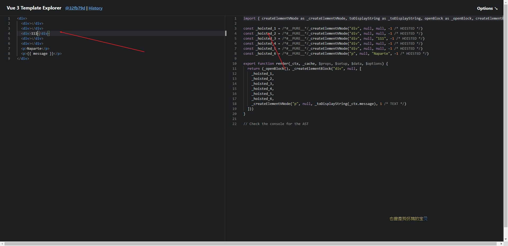

## Vue3 概览

> 目录说明

| 包名                 | 描述                                                                           |
| -------------------- | ------------------------------------------------------------------------------ |
| @vue/shared          | 包含通用的工具函数和常量，是其他包的依赖项                                     |
| @vue/reactivity      | 实现了 Vue.js 的响应式系统，包括依赖追踪和触发更新等功能                       |
| @vue/compiler-core   | Vue.js 编译器的核心包，将模板编译为渲染函数                                    |
| @vue/runtime-core    | Vue.js 运行时的核心包，提供组件实例化和虚拟 DOM 渲染等功能                     |
| @vue/runtime-dom     | Vue.js 运行时的 DOM 版本包，提供在浏览器环境下运行 Vue.js 的功能               |
| @vue/compiler-dom    | Vue.js 编译器的 DOM 版本包，将模板编译为浏览器可执行的渲染函数                 |
| @vue/server-renderer | Vue.js 服务器端渲染（SSR）的渲染器包，用于在服务器端渲染 Vue.js 应用           |
| @vue/compiler-ssr    | Vue.js 编译器的服务器端渲染（SSR）版本包，将模板编译为服务器端可执行的渲染函数 |
| @vue/test-utils      | Vue.js 的测试工具包，用于编写和运行单元测试和集成测试                          |
| @vue/use             | Vue.js 的 Composition API 的实现包，用于支持组合式开发                         |

> 响应式想要解决的问题

```javascript
let a = 1;
let b = 2 * a;
// 要始终保持b是a的2倍，需要 指令式 的调用方法
a = 3;
b = 2 * a;
// 响应式想要解决的是类似 fx = A * 2 这类有明确关系的中间处理函数的维护成本；保证A和B的同步
```

```vue
<!-- 衍生：加入state的a属性修改，界面dom要显示 出来；
 维护的是状态和dom输出之间的逻辑（声明式渲染） -->

<span>
{{state.a * 10}}
</span>

onStateChanged (()=>{ view = render(state) })
```

- vue 实现了追踪变量的依赖（称之为追踪器），然后执行对应的“副作用”逻辑

## vue2 和 vue3 的不同

1. 双向数据绑定原理不同
2. 是否支持碎片
   1. vue2：vue2 不支持碎片。
   2. vue3：vue3 支持碎片（Fragments） ，就是说可以拥有多个根节点。
3. API 类型不同
   1. vue2：vue2 使用选项类型 api，选项型 api 在代码里分割了不同的属性：data,computed,methods 等
   2. vue3：vue3 使用 Composition API ，相比于旧的 api 使用属性来分组，这样代码会更加简便和整洁
4. 定义数据变量和方法不同
   1. vue2：vue2 是把数据放入 data 中，在 vue2 中定义数据变量是 data(){} ，创建的方法要在 methods:{} 中
   2. vue3：vue3 就需要使用一个新的 setup()方法，此方法在组件初始化构造的时候触发
5. 生命周期的变化

> PatchFlag 带来的性能提升

- Vue 2.x 中的虚拟 DOM 是全量对比的模式，而到了 Vue 3.0 开始，新增了静态标记（PatchFlag）
- Vue3 在模板编译阶段 用 hoisted、openBlock 进行 静态提升；由 Vue2 的 vdom 全量对比改成只对比修改过的 dom
- 
