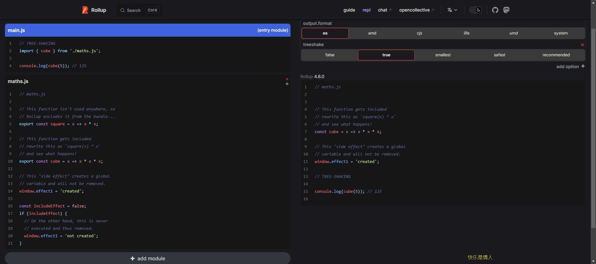

# TreeShaking

## 什么是 TreeShaking ？

- 业界知名的模块打包器 rollup.js 的作者 Rich Harris 在 2015 年 12 月的一篇博客[《Tree-shaking versus dead code elimination》](https://medium.com/@Rich_Harris/tree-shaking-versus-dead-code-elimination-d3765df85c80) 中首次提到了 Tree-Shaking 的概念，

```text
 I’ve been working (albeit sporadically of late, admittedly) on a tool called Rollup, which bundles together JavaScript modules. One of its features is tree-shaking, by which I mean that it only includes the bits of code your bundle actually needs to run.
```

- Tree-Shaking 是为了 Dead code elimination (DCE)，这是编译器原理中常见的一种编译优化技术，简单来说就是消除无用代码（Dead code）

## Dead Code 特征

- 代码不会被执行，不可到达
- 代码执行的结果不会被用到
- 代码只会影响死变量（只写不读）

## 原理

### 思路一

> 第一步：解析源代码生成 ast
> 第二步：遍历 ast，记录相关信息

- 收集所有的函数或变量类型节点
- 收集所有使用过的函数或变量类型节点

> 第三步：根据第二步得到的信息，生成新代码

### rollup 跨文件 Tree Shaking 原理

- `静态分析模块依赖`： Rollup 会首先对整个代码库进行静态分析，识别模块之间的依赖关系，构建模块依赖图。这包括识别模块之间的 import 和 export 关系，以及模块内部的函数、变量等的定义和引用关系。
- `标记被引用的代码`： 从入口模块开始，Rollup 会递归地标记被引用的代码，包括跨模块的引用关系。当一个模块中的某个导出被其他模块引用时，Rollup 会标记这个导出为被引用的代码，以确保它不会被 Tree Shaking 移除。
- `剔除未被引用的代码`： 在标记过程中，Rollup 会识别出未被引用的代码，无论是在当前模块还是跨模块的引用关系中。这些未被引用的代码将被从最终的打包结果中剔除，以减小文件体积。
- `生成优化的输出`： 最终，Rollup 会生成经过跨文件 Tree Shaking 优化的输出文件，其中只包含实际被使用到的代码部分，无论这些代码是来自当前模块还是其他模块。

> rollup 效果

- [rollup 在线效果](https://rollupjs.org/repl/?version=4.8.0&shareable=JTdCJTIyZXhhbXBsZSUyMiUzQSUyMjAwJTIyJTJDJTIybW9kdWxlcyUyMiUzQSU1QiU3QiUyMmNvZGUlMjIlM0ElMjIlMkYlMkYlMjBUUkVFLVNIQUtJTkclNUNuaW1wb3J0JTIwJTdCJTIwY3ViZSUyMCU3RCUyMGZyb20lMjAnLiUyRm1hdGhzLmpzJyUzQiU1Q24lNUNuY29uc29sZS5sb2coY3ViZSg1KSklM0IlMjAlMkYlMkYlMjAxMjUlMjIlMkMlMjJpc0VudHJ5JTIyJTNBdHJ1ZSUyQyUyMm5hbWUlMjIlM0ElMjJtYWluLmpzJTIyJTdEJTJDJTdCJTIyY29kZSUyMiUzQSUyMiUyRiUyRiUyMG1hdGhzLmpzJTVDbiU1Q24lMkYlMkYlMjBUaGlzJTIwZnVuY3Rpb24lMjBpc24ndCUyMHVzZWQlMjBhbnl3aGVyZSUyQyUyMHNvJTVDbiUyRiUyRiUyMFJvbGx1cCUyMGV4Y2x1ZGVzJTIwaXQlMjBmcm9tJTIwdGhlJTIwYnVuZGxlLi4uJTVDbmV4cG9ydCUyMGNvbnN0JTIwc3F1YXJlJTIwJTNEJTIweCUyMCUzRCUzRSUyMHglMjAqJTIweCUzQiU1Q24lNUNuJTJGJTJGJTIwVGhpcyUyMGZ1bmN0aW9uJTIwZ2V0cyUyMGluY2x1ZGVkJTVDbiUyRiUyRiUyMHJld3JpdGUlMjB0aGlzJTIwYXMlMjAlNjBzcXVhcmUoeCklMjAqJTIweCU2MCU1Q24lMkYlMkYlMjBhbmQlMjBzZWUlMjB3aGF0JTIwaGFwcGVucyElNUNuZXhwb3J0JTIwY29uc3QlMjBjdWJlJTIwJTNEJTIweCUyMCUzRCUzRSUyMHglMjAqJTIweCUyMColMjB4JTNCJTVDbiU1Q24lMkYlMkYlMjBUaGlzJTIwJTVDJTIyc2lkZSUyMGVmZmVjdCU1QyUyMiUyMGNyZWF0ZXMlMjBhJTIwZ2xvYmFsJTVDbiUyRiUyRiUyMHZhcmlhYmxlJTIwYW5kJTIwd2lsbCUyMG5vdCUyMGJlJTIwcmVtb3ZlZC4lNUNud2luZG93LmVmZmVjdDElMjAlM0QlMjAnY3JlYXRlZCclM0IlNUNuJTVDbmNvbnN0JTIwaW5jbHVkZUVmZmVjdCUyMCUzRCUyMGZhbHNlJTNCJTVDbmlmJTIwKGluY2x1ZGVFZmZlY3QpJTIwJTdCJTVDbiU1Q3QlMkYlMkYlMjBPbiUyMHRoZSUyMG90aGVyJTIwaGFuZCUyQyUyMHRoaXMlMjBpcyUyMG5ldmVyJTVDbiU1Q3QlMkYlMkYlMjBleGVjdXRlZCUyMGFuZCUyMHRodXMlMjByZW1vdmVkLiU1Q24lNUN0d2luZG93LmVmZmVjdDElMjAlM0QlMjAnbm90JTIwY3JlYXRlZCclM0IlNUNuJTdEJTIyJTJDJTIyaXNFbnRyeSUyMiUzQWZhbHNlJTJDJTIybmFtZSUyMiUzQSUyMm1hdGhzLmpzJTIyJTdEJTVEJTJDJTIyb3B0aW9ucyUyMiUzQSU3QiUyMm91dHB1dCUyMiUzQSU3QiUyMmZvcm1hdCUyMiUzQSUyMmVzJTIyJTdEJTJDJTIydHJlZXNoYWtlJTIyJTNBdHJ1ZSU3RCU3RA==)



## 参考文献

- https://juejin.cn/post/7265125368553685050#heading-5
- https://juejin.cn/post/6844903544756109319
