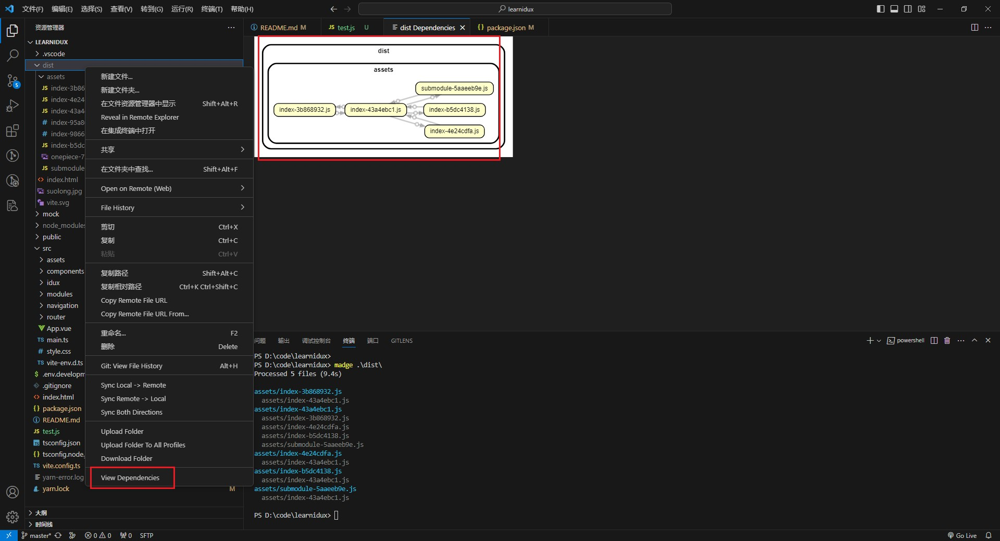

# Madge 一个生成模块依赖关系树的工具

## Madge 是什么？

Madge 的原理主要基于静态代码分析和图论算法。其主要原理包括以下几个步骤：

静态代码分析：Madge 通过读取项目中的源代码文件，分析其中的模块引入语句（如 require、import 等），识别模块之间的依赖关系。这一步骤可以借助 JavaScript 解析器来解析代码，识别模块引入语句，并构建模块之间的依赖关系。

构建依赖关系图：基于静态代码分析的结果，Madge 构建模块之间的依赖关系图。这个图可以是一个有向图，其中每个节点代表一个模块，边代表模块之间的依赖关系。Madge 可以根据项目的实际情况构建完整的依赖关系图。

循环依赖检测：Madge 还会对依赖关系图进行分析，检测其中是否存在循环依赖的情况。这一步可以通过图论算法来实现，例如深度优先搜索（DFS）或拓扑排序等算法来检测图中的循环依赖。

可视化输出：最后，Madge 可以根据构建的依赖关系图，生成可视化的输出，以便开发者直观地了解模块之间的依赖关系。这可以通过将图转换为 SVG、PNG 等格式的图像文件，或者输出为 JSON 格式的数据，供开发者进一步处理和利用。

综合来看，Madge 的原理基于静态代码分析和图论算法，通过分析项目中的模块引入语句，构建模块之间的依赖关系图，并提供可视化输出，帮助开发者理解和管理项目中的模块依赖关系。

## 对比分析其他依赖的工具

- dependency-tree
- precinct
- rollup-plugin-visualizer
- webpack-bundle-analyzer
- dependency-cruiser

> dependency-tree:

- 功能：dependency-tree 是一个用于生成 JavaScript 项目依赖树的工具。它可以帮助你可视化项目中的依赖关系，包括直接和间接依赖。
- 差异：与其他工具相比，dependency-tree 主要关注于展示项目的依赖树结构，帮助开发者理解项目中各个模块之间的依赖关系。

> precinct:

- 功能：precinct 是一个用于静态分析 JavaScript 项目的工具，可以检测代码风格、错误和潜在问题，以及生成代码覆盖率报告。
- 差异：与其他工具相比，precinct 主要关注于静态代码分析，帮助开发者确保项目的代码质量和可靠性。
- 

> rollup-plugin-visualizer 和 webpack-bundle-analyzer:

- 功能：这两个工具都是用于可视化 JavaScript 项目打包结果的工具，可以生成直观的包大小和依赖关系图表，帮助开发者优化项目的打包结果。
- 差异：rollup-plugin-visualizer 适用于 Rollup 打包工具，而 webpack-bundle-analyzer 则适用于 Webpack 打包工具。它们的功能类似，但针对不同的打包工具进行了定制。

> dependency-cruiser: (有 vscode 插件版本)

- 功能：dependency-cruiser 是一个用于分析和可视化 JavaScript 项目的依赖关系的工具，可以帮助开发者理解项目中的模块依赖关系，并检测循环依赖等问题。
- 差异：与其他工具相比，dependency-cruiser 主要关注于分析和可视化项目的依赖关系，帮助开发者理清项目结构和依赖关系。
- 
