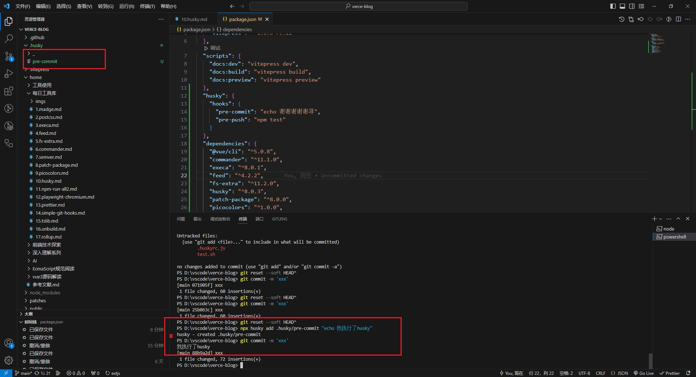

# husky

## 什么是 Husky？

Husky 是一个用于在 Git 提交前执行脚本的工具包。它可以方便地管理 Git 钩子，如 pre-commit、pre-push 等，使得在特定 Git 操作前执行脚本变得简单。通过 Husky，开发团队可以在代码提交前自动执行代码规范检查、单元测试等操作，从而确保提交的代码质量。

## 如何使用 Husky？

使用 Husky 非常简单。首先，我们需要在项目的 package.json 文件中配置 Husky 的 hooks，指定在特定 Git 钩子触发时需要执行的脚本。例如，我们可以在 pre-commit 钩子触发时执行代码规范检查，在 pre-push 钩子触发时执行单元测试。以下是一个示例配置：

> 使用命令行工具配置 Husky

- `新版本推荐方式`

```shell
npx husky add .husky/pre-commit "npm run lint"
npx husky add .husky/pre-push "npm test"
```

> package.json 文件中的 "husky" 字段下配置

- `注意：新版本不支持了`

```json
// package.json
{
  "husky": {
    "hooks": {
      "pre-commit": "npm run lint",
      "pre-push": "npm test"
    }
  }
}
```

- 通过上述命令 Git 挂钩可以使用 .husky/ 目录中挂钩的单独文件进行配置的

> 使用 .huskyrc.js 配置文件

- `注意：新版本不支持了`

```javascript
// .huskyrc.js
module.exports = {
  hooks: {
    "pre-commit": "npm run lint",
    "pre-push": "npm test",
  },
};
```

- 

## git hook 钩子

| 钩子名称           | 功能                                           | 说明                                                       |
| ------------------ | ---------------------------------------------- | ---------------------------------------------------------- |
| applypatch-msg     | 在执行 git am 命令时，用于验证提交消息         | 可以用于验证提交消息的格式，拒绝不符合规范的提交消息       |
| pre-applypatch     | 在执行 git am 命令之前                         | 可以在应用补丁前执行自定义操作，如检查环境、备份数据等     |
| post-applypatch    | 在执行 git am 命令之后                         | 可以在应用补丁后执行自定义操作，如清理临时文件、发送通知等 |
| pre-commit         | 在执行 git commit 命令之前                     | 可以在提交前执行自定义操作，如代码风格检查、单元测试等     |
| prepare-commit-msg | 在执行 git commit 命令时，用于编辑提交消息     | 可以用于编辑提交消息，如添加自动化生成的信息或模板         |
| commit-msg         | 在执行 git commit 命令时，用于验证提交消息     | 可以用于验证提交消息的格式，拒绝不符合规范的提交消息       |
| post-commit        | 在执行 git commit 命令之后                     | 可以在提交后执行自定义操作，如更新文档、触发构建等         |
| pre-rebase         | 在执行 git rebase 命令之前                     | 可以在变基操作前执行自定义操作，如暂存工作区、中断变基等   |
| post-checkout      | 在执行 git checkout 命令之后                   | 可以在切换分支后执行自定义操作，如更新依赖、清理缓存等     |
| post-merge         | 在执行 git merge 命令之后                      | 可以在合并后执行自定义操作，如触发自动化测试、更新子模块等 |
| pre-push           | 在执行 git push 命令之前                       | 可以在推送前执行自定义操作，如运行集成测试、检查代码规范等 |
| pre-receive        | 在接收 git push 命令时                         | 可以在接收推送时执行自定义操作，如拒绝非法提交、检查权限等 |
| update             | 在接收 git push 命令时，用于验证更新           | 可以用于验证更新操作，如拒绝不符合规范的更新               |
| post-receive       | 在接收 git push 命令后                         | 可以在接收推送后执行自定义操作，如触发部署、发送通知等     |
| post-update        | 在接收 git push 命令后，用于更新参考           | 可以在更新参考后执行自定义操作，如清理缓存、触发后续任务等 |
| pre-auto-gc        | 在执行 git gc --auto 命令之前                  | 可以在自动垃圾回收前执行自定义操作，如暂停服务、备份数据等 |
| post-rewrite       | 在执行 git commit --amend 或 git rebase 命令后 | 可以在重写历史后执行自定义操作，如更新相关引用、发送通知等 |

## 同类型工具

- simple-git-hooks

## 参考文献

- https://git-scm.com/docs/githooks
